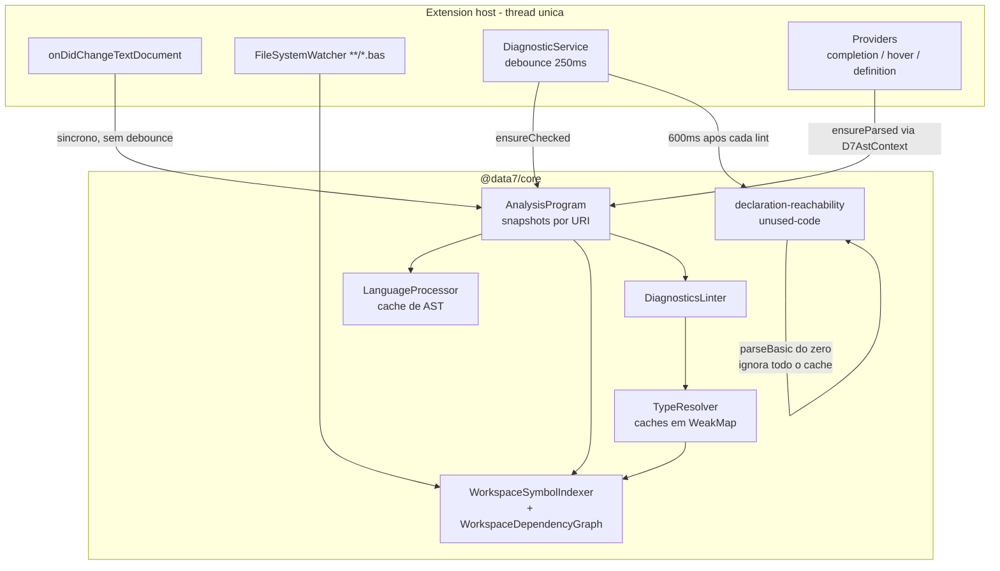

# Refatoração do motor de análise (AST → Linter → Pré-build)

> Documento de trabalho. Auditoria do motor de análise atual e plano de refatoração em fases
> até um Language Server dedicado, no estilo do `tsserver`.
>
> **Status:** proposto, não iniciado.
> **Escopo:** `packages/data7-core/src/analysis/`, `packages/data7-core/src/diagnostics/`,
> `packages/data7-core/src/project/parser/`, `packages/data7-vscode/src/services/diagnostic-service.ts`,
> `packages/data7-vscode/src/extension.ts` e `packages/data7-vscode/src/providers/`.

---

## Sumário

1. [Objetivo](#1-objetivo)
2. [Resumo executivo](#2-resumo-executivo)
3. [Mapa do pipeline atual](#3-mapa-do-pipeline-atual)
4. [Auditoria — gargalos de performance](#4-auditoria--gargalos-de-performance)
5. [Auditoria — furos de corretude e staleness](#5-auditoria--furos-de-corretude-e-staleness)
6. [Auditoria — estado global e efeitos colaterais](#6-auditoria--estado-global-e-efeitos-colaterais)
7. [Auditoria — cache frio vs. cache quente](#7-auditoria--cache-frio-vs-cache-quente)
8. [Arquitetura alvo e conceitos](#8-arquitetura-alvo-e-conceitos)
9. [Fases da refatoração](#9-fases-da-refatoração)
10. [Métricas e critérios de aceite](#10-métricas-e-critérios-de-aceite)
11. [Riscos e plano de rollback](#11-riscos-e-plano-de-rollback)
12. [Impacto em testes e documentação](#12-impacto-em-testes-e-documentação)

---

## 1. Objetivo

O linter da extensão produz **regras e diagnósticos corretos**, mas o _motor_ que os executa
tem três defeitos operacionais:

- **Latência** — a IDE trava durante a digitação, ao salvar, ao mover, renomear e incluir arquivos.
- **Staleness** — a aba _Problems_ mostra diagnósticos já corrigidos, e correções demoram (ou
  falham) em se propagar para o próprio arquivo e para os arquivos dependentes.
- **Fragilidade** — em vários cenários é necessário reiniciar o linter ou a janela da IDE para
  recuperar dados corretos.

O objetivo final é um motor **incremental, resiliente e sempre atualizado**, com a análise rodando
fora da thread do extension host, no modelo do TypeScript Language Server.

### Premissa central do plano

> **A migração para LSP não corrige, sozinha, os sintomas relatados.**

Os defeitos de staleness e a maior parte da lentidão estão no **modelo de invalidação e de
agendamento**, que é agnóstico de processo. Mover o motor atual para outro processo levaria
os mesmos bugs junto, e ainda adicionaria uma fronteira de serialização a depurar.

Por isso a correção desses dois modelos é uma **etapa própria e obrigatória** — a
[Fase 1](#fase-1--correção-do-modelo-de-invalidação-e-agendamento) — e não um efeito colateral
esperado da migração. Ela tem critério de saída explícito e uma
[matriz de rastreabilidade](#matriz-de-rastreabilidade-da-fase-1) que liga **cada** achado desta
auditoria ao item que o corrige e ao teste que impede a regressão.

Portanto o plano é sequenciado em duas metades:

| Metade        | O que faz                                                                   | Risco | Ganho                                 |
| ------------- | --------------------------------------------------------------------------- | ----- | ------------------------------------- |
| **Fases 0–2** | Corrige os modelos de invalidação e agendamento; prepara fronteira headless | Baixo | Alto e imediato                       |
| **Fases 3–7** | Extrai o Language Server e migra os providers                               | Alto  | Isolamento de CPU e cancelamento real |

Todo o trabalho das Fases 0–2 **viaja junto** para o servidor. Nada é jogado fora.

> **Compromisso do plano:** ao fim da Fase 1, todos os sintomas relatados — lentidão ao digitar e
> ao salvar, diagnósticos obsoletos, correções que não propagam e necessidade de reiniciar a
> janela — estão resolvidos e cobertos por teste. As Fases 3–7 melhoram a responsividade e a
> arquitetura, mas **não** são pré-requisito para nenhuma dessas correções.

---

## 2. Resumo executivo

Quatro achados explicam diretamente os sintomas relatados.

### 2.1 A passada de `unused-code` re-parseia o workspace inteiro a cada 600 ms de digitação

Este é o gargalo número um. Toda vez que o lint ao vivo termina, `scheduleUnusedCodeRefresh()`
agenda uma reanálise de alcançabilidade de **todo o workspace**
(`packages/data7-vscode/src/services/diagnostic-service.ts:1335-1342`):

```ts
private static scheduleUnusedCodeRefresh(): void {
  if (this.unusedCodeRefreshScheduled) return;
  this.unusedCodeRefreshScheduled = true;
  setTimeout(() => {
    this.unusedCodeRefreshScheduled = false;
    void this.refreshUnusedCodeDiagnostics();
  }, 600);
}
```

`refreshUnusedCodeDiagnostics` então (mesmo arquivo, linhas 1349–1402):

1. Chama `findWorkspaceBasFiles()` → `vscode.workspace.findFiles("**/*.{bas,d7b}")`, **sem cache**.
2. Chama `collectReachabilityModules()`, que lê do disco (`fs.promises.readFile`) **todo `.bas` fechado**.
3. Chama `collectUnusedCodeDiagnostics` → `analyzeDeclarationReachability`, que faz um
   **parse completo do zero** de cada módulo, ignorando por completo o `LanguageProcessor` e
   o `AnalysisProgram` (`packages/data7-core/src/analysis/declaration-reachability/index.ts:49-52`):

```ts
const parsed: ParsedReachabilityModule[] = modules.map((input) => ({
  input,
  parse: parseBasic(input.code),
}));
```

Em um projeto de 300 arquivos, cada pausa de 600 ms na digitação dispara 300 leituras de disco e
300 parses completos, na thread do extension host.

**Agravantes:**

- `modules.find(...)` dentro do laço de _hits_ (linha 1390) é O(hits × módulos).
- `unusedCodeRefreshScheduled` protege apenas o **agendamento**: a flag é zerada antes do `await`,
  então várias passadas full-workspace podem executar **concorrentemente**.
- Quando o arquivo em edição tem erro de parse transitório (normal enquanto se digita),
  `skippedDueToParseErrors` faz a função retornar `[]`, e **todos** os hints de `unused-code`
  do projeto desaparecem e reaparecem — o "piscar" da aba _Problems_.

### 2.2 O `CheckScheduler` é código morto

`AnalysisProgram.ensureChecked` enfileira arquivos grandes para processamento assíncrono
(`packages/data7-core/src/analysis/analysis-program.ts:145-148`):

```ts
if (this.shouldOffload(snapshot)) {
  // Schedule async worker path; still return a sync check for immediate consumers.
  this.scheduler.enqueue(uri, priority);
}
return this.runCheckOnSnapshot(snapshot, token);
```

Mas `flushScheduled()` — o único método que drena a fila — **não tem nenhum chamador em todo o
repositório**. Consequência: arquivos com mais de 2500 linhas (ou cujo último check passou de
400 ms) fazem o trabalho síncrono **e** acumulam entradas numa fila que nunca executa. O
mecanismo de _offload_ que existe no código nunca chegou a funcionar.

### 2.3 O linter morre silenciosamente quando a indexação falha

`packages/data7-vscode/src/extension.ts:152-167`:

```ts
async () => {
  try {
    await indexer.indexWorkspace(vscode.workspace.workspaceFolders);
    DiagnosticService.markWorkspaceIndexReady();
    // ...
  } catch (err) {
    logger.error("Erro ao indexar workspace.", err);
  }
}
```

`markWorkspaceIndexReady()` só é chamado no caminho de sucesso. Se `indexWorkspace` lançar
(um `.bas` corrompido, uma permissão negada, um `readFileSync` falhando), a flag
`workspaceIndexReady` fica `false` **para sempre**. E o portão de entrada do lint
(`diagnostic-service.ts:134-137`) descarta silenciosamente todo documento aberto:

```ts
if (!this.workspaceIndexReady && !reevaluateDependent) {
  this.pendingOpenDocuments.add(doc.uri.toString().toLowerCase());
  return;
}
```

`pendingOpenDocuments` nunca é drenado. **Esta é a causa raiz do "tenho que reiniciar a janela".**

### 2.4 A propagação para dependentes lê estado global sobrescrito a cada tecla

`runDependentPropagation` decide se vale a pena re-lintar os dependentes consultando
`hasLastUpdateChangedAPI` (`diagnostic-service.ts:481-489`):

```ts
const apiChanged = indexer.hasLastUpdateChangedAPI(triggerUriStr);
// ...
if (!force && !apiChanged) {
  return;
}
const extraNamespaces = new Set<string>(indexer.changedNamespacesInLastUpdate);
indexer.changedNamespacesInLastUpdate.clear();
```

O problema é que `lastUpdateApiChanged` é **sobrescrito a cada chamada de
`updateFileContentFromParsed`** (`symbol-indexer.ts:1118`, `1093`), e o listener
`onDidChangeTextDocument` em `extension.ts:208-216` chama `AnalysisProgram.update` — e portanto
`updateFileContentFromParsed` — **a cada tecla digitada**.

Resultado: no momento em que o _save_ dispara a propagação, `lastUpdateApiChanged` reflete o
delta da **última tecla** (quase sempre `false`), não o delta acumulado desde o último lint.
Quem corrigiu uma assinatura pública e salvou não vê os dependentes serem reavaliados.

Pior: `changedNamespacesInLastUpdate` é um `Set` público mutável no indexer que **o consumidor
limpa** (`clear()` na linha 489). Qualquer outro consumidor — ou uma segunda propagação
concorrente — perde a informação. É uma corrida clássica produtor/consumidor sobre estado global.

---

## 3. Mapa do pipeline atual



O desenho está correto no papel: existe um `AnalysisProgram` único, com snapshots versionados
por conteúdo, caches em camadas e um grafo de dependência reverso. Os problemas estão nas
arestas destacadas: o caminho da tecla é síncrono e não debounced, e o caminho de `unused-code`
contorna todo o sistema de cache.

### Tamanho dos módulos envolvidos

| Arquivo                                             | Linhas |
| --------------------------------------------------- | -----: |
| `analysis/type-resolver.ts`                         |   3449 |
| `analysis/symbol-indexer.ts`                        |   1713 |
| `services/diagnostic-service.ts` (vscode)           |   1506 |
| `analysis/declaration-reachability/reachability.ts` |   1172 |
| `analysis/ast-context.ts`                           |   1068 |
| `project/parser/parser.ts`                          |   1126 |
| `analysis/analysis-program.ts`                      |    197 |
| `analysis/workspace-dependency-graph.ts`            |    158 |

---

## 4. Auditoria — gargalos de performance

### 4.1 Invalidação global de caches a cada tecla

`invalidateLocalCaches()` (`symbol-indexer.ts:520-526`) é chamado ao fim de **todo**
`updateFileContent` / `updateFileContentFromParsed` (linhas 1039, 1101, e equivalente em
`updateFileContentFromParsed`):

```ts
private invalidateLocalCaches(): void {
  this.invalidateAggregateSymbolCaches();  // symbolsByName, symbolsByContainer, allSymbols
  this.findMemberCache.clear();
  this.allMembersForTypeCache.clear();
  this.ownMembersForClassCache.clear();
  this.inheritedMembersForClassCache.clear();
}
```

Digitar **uma letra** em um arquivo zera os caches de resolução de membros do **workspace
inteiro**. O próximo hover, completion ou lint reconstrói tudo do zero, incluindo a caminhada
de herança de cada tipo consultado.

Este é o segundo maior gargalo, e é o que faz a digitação "engasgar" mesmo em arquivos pequenos.

### 4.2 Parse e indexação síncronos, sem debounce, na tecla

`extension.ts:208-216`:

```ts
const docChangeListener = vscode.workspace.onDidChangeTextDocument((e) => {
  if (e.document.languageId === LANGUAGE_IDS.d7basic || e.document.fileName.endsWith(".bas")) {
    AnalysisProgram.getInstance().update(
      e.document.uri.toString(),
      e.document.getText(),
      e.document.version,
    );
  }
});
```

A intenção documentada é boa (manter os providers frescos sem esperar o debounce do lint), mas o
custo real de `update` é: `hashContent` do arquivo inteiro → `parseBasic` completo (lexer +
parser recursivo, sem parsing incremental) → `SymbolParser.parseFromAst` (walk completo da AST) →
`updateFileContentFromParsed` (comparação de API + invalidação global). Tudo síncrono, a cada tecla.

Só o **lint** está protegido por debounce (250 ms); a parte cara não está.

Há ainda um **parse duplicado por tecla**: `AnalysisProgram.update` faz o trabalho imediatamente,
e 250 ms depois o `DiagnosticService` chama `ensureParsed` + `ensureChecked` sobre o mesmo conteúdo.

### 4.3 `buildLintDependencyFingerprint` é O(nº de arquivos) por check

`symbol-indexer.ts:595-603`:

```ts
let principalRevision = 0;
for (const file of this.cache.values()) {
  if (file.filePath.toLowerCase().endsWith(`${path.sep}principal.bas`)) {
    principalRevision = Math.max(
      principalRevision,
      this.fileRevisions.get(this.getCacheKey(file.fileUri)) ?? 0,
    );
  }
}
```

Varre **todo** o cache do workspace atrás do `Principal.bas`, a cada `ensureChecked`. E
`ensureChecked` chama isso **duas vezes** por check (linhas 129 e 200 de `analysis-program.ts`).
Numa propagação para N dependentes, o custo é O(N × arquivos) só para montar fingerprints.

### 4.4 `getDependentFileUris` faz varredura linear

`workspace-dependency-graph.ts:134-143` — a aresta "arquivos que compartilham namespace com o
gatilho" percorre `declaredNamespacesByFile` inteiro:

```ts
if (declared && declared.size > 0) {
  for (const [fileKey, fileNamespaces] of this.declaredNamespacesByFile) {
    if (fileKey === triggerKey || visited.has(fileKey)) continue;
    for (const ns of fileNamespaces) {
      if (declared.has(ns)) { dependents.add(fileKey); break; }
    }
  }
}
```

Falta um índice `namespace → arquivos que declaram` (hoje só existe `namespaceOwners`, que é
`namespace → 1 arquivo`, perdendo o caso de namespace declarado em vários arquivos — comum em Data7).

### 4.5 `Principal.bas` re-linta o workspace inteiro

`diagnostic-service.ts:493-498`: como os símbolos de `Principal.bas` são ambientes (sem aresta
`Imports`), qualquer save nele enfileira **todos** os `.bas` do workspace para re-lint. Correto
semanticamente, brutal na prática — e é o arquivo que mais se edita no início de um projeto.

### 4.6 I/O síncrono no extension host

- `symbol-indexer.ts:1008` — `readFileSync` no caminho de `indexFile`.
- `language-processor.ts:187-188` — `readFileSync` no fallback de `readDocumentContent`.
- `diagnostic-service.ts:666-711` — `getWorkspaceCache` faz varreduras de disco síncronas
  (`data7.json`, repositório de módulos compartilhados, `src/`, `data7_modules/`) no primeiro lint.
- `workspace-fix-service.ts` — `fs.writeFileSync` em lote durante _fix all_.

### 4.7 `getOrParse` compara conteúdo por igualdade de string inteira

`language-processor.ts:68-82`:

```ts
const cached = this.cache.get(key);
if (cached) {
  if (content === undefined || cached.content === content) {
    return cached;
  }
}
```

O cache é indexado apenas pela URI (sem versão), e o _hit_ exige comparar duas strings do
tamanho do arquivo. Em arquivos grandes, o próprio teste de cache custa caro — e ele roda em
todo `ensureParsed`, ou seja, em toda construção de `D7AstContext`, ou seja, em todo hover e
completion.

### 4.8 Passada de TypeMap sobre todas as expressões

`analysis-program.ts:206-208` executa, em cada check:

```ts
warmLintTypeResolutionIndexes(snapshot.unit, document, this.indexer);
buildExpressionTypeMap(snapshot.unit, document, this.indexer);
```

`buildExpressionTypeMap` (`expression-type-map.ts:19-34`) percorre **todos** os nós de expressão
da unidade chamando `TypeResolver.resolveExpressionType`. A ideia é amortizar (as regras depois
reusam o WeakMap), e é uma boa ideia — mas como os caches de membro do indexer foram zerados
pela tecla anterior (§4.1), cada resolução paga o caminho frio de novo.

### 4.9 Caminhos que varrem todos os símbolos

Chamadas a `indexer.getAllSymbols()` em caminhos de genéricos, que materializam e filtram a
lista completa de símbolos do workspace:

- `type-resolver.ts:2393-2401` — `parseFlatGenericTypeReference`
- `type-resolver.ts:1553, 1565, 1611, 1729` — `computeGenericInstantiations`
- `symbol-indexer.ts:1487` — `genericTemplateCacheSignature`
- `type-resolver.ts:128-141` — `findInnermostClassSymbol` (filtro linear sobre símbolos do arquivo)

### 4.10 Custo do worker pool

`exportLintSnapshot()` (`symbol-indexer.ts:717-731`) copia **o conteúdo completo de todos os
arquivos** mais os símbolos, e cada worker recebe uma cópia integral via _structured clone_.
Com 8 workers, são 8 cópias do workspace em memória. O pool está ligado por padrão em qualquer
máquina com 2+ CPUs (`lint-worker-pool.ts:69-74`).

---

## 5. Auditoria — furos de corretude e staleness

### 5.1 Payloads de diagnóstico não sobrevivem à serialização

`lint-diagnostic-transfer.ts:13-26` — `serializeLintDiagnostics` **não copia `diag.data`**:

```ts
return diagnostics.map((diag) => ({
  startLine: diag.range.start.line,
  // ... range, message, severity, code, source
  // data: AUSENTE
}));
```

E `deserializeWorkerDiagnostics` (`diagnostic-service.ts:1267-1283`) reconstrói os diagnósticos
sem reanexar payload algum.

Como o `code-action-provider` lê os payloads via `readDiagnosticPayload`
(`code-action-helpers.ts:21-29`), **os quick fixes já estão quebrados hoje** para todo arquivo
lintado pelo worker pool — ou seja, para arquivos fechados durante um lint de workspace. O
diagnóstico aparece, mas a lâmpada não oferece a correção.

Isto é **bloqueante para a migração LSP**, onde toda a comunicação é serializada. São 77 códigos
de diagnóstico e 41 tipos de payload em `diagnostics/diagnostic-codes.ts`. A boa notícia: todos
os payloads são estruturas JSON puras (strings, números, booleanos, arrays de string, objetos
rasos) — nenhum carrega nó de AST, `SymbolInfo`, função ou instância de classe. O problema é
**não serem transmitidos**, não a forma deles.

### 5.2 Cancelamento é apenas descarte de resultado

O "token" passado ao linter é sintético (`diagnostic-service.ts:1174-1188`):

```ts
const cancelToken = {
  get isCancellationRequested(): boolean { return isStale(); },
};
```

`isStale()` compara o número de geração da URI. Isso funciona para **descartar** um resultado
obsoleto, mas o trabalho já foi todo executado — de forma síncrona, bloqueando o event loop. Não
há `vscode.CancellationToken` real na cadeia, e não há pontos de rendimento (`yield`) dentro do
`runAdvancedDiagnostics` para que uma passada longa possa ser efetivamente interrompida.

Consequência prática: digitar rápido em um arquivo grande executa N passadas completas de lint,
das quais N−1 têm o resultado jogado fora — mas todas as N consumiram CPU integralmente.

### 5.3 Mudança externa em arquivo fechado nunca lintado é ignorada

`diagnostic-service.ts:1257-1264` — `refreshFromExternalChange` só re-linta arquivos que já
estão em `liveDiagnosticUris` ou `workspaceDiagnosticUris`. Um arquivo alterado por `git checkout`,
por outra ferramenta, ou criado fora do editor, e que nunca foi lintado, **não gera diagnóstico**
até ser aberto manualmente.

### 5.4 O watcher descarta snapshots válidos

`extension.ts:182-186` — em `onDidChange` do watcher, o código faz `AnalysisProgram.close(uri)` +
`LanguageProcessor.invalidate(uri)` + `indexer.indexFile(uri)`. `close()` remove o snapshot
inteiro (parse, símbolos, bind, check) mesmo quando o conteúdo em disco é idêntico ao que já
está em memória — o caso comum logo após um save do próprio editor.

### 5.5 `AnalysisProgram.close` não remove o arquivo do indexer

`analysis-program.ts:91-96` remove o snapshot e invalida o `LanguageProcessor`, mas não toca no
`WorkspaceSymbolIndexer`. A remoção do indexer só acontece via `indexer.removeFile`, chamado
apenas no `onDidDelete` do watcher. Fechar uma aba não deve desindexar (correto), mas a assimetria
não está documentada e já causou divergência entre as duas fontes de verdade.

### 5.6 `data7.json` não dispara re-lint

`diagnostic-service.ts:208-217` — o watcher de `**/data7.json` invalida apenas o
`workspaceCache` de referências de módulo. Mudanças em `exclude`, em `diagnosticSeverity` ou nas
opções de prune não re-avaliam os arquivos já lintados.

### 5.7 A propagação não é transitiva

`getDependentFileUris` retorna apenas os dependentes **diretos**. Se `A` declara um namespace
importado por `B`, e `B` declara um namespace importado por `C`, uma mudança de API em `A` não
alcança `C`. Falta o fecho transitivo (com limite de profundidade e detecção de ciclo).

---

## 6. Auditoria — estado global e efeitos colaterais

| Estado                          | Onde                                        | Problema                                                                               |
| ------------------------------- | ------------------------------------------- | -------------------------------------------------------------------------------------- |
| `changedNamespacesInLastUpdate` | `symbol-indexer.ts` (campo público mutável) | Produtor escreve, consumidor faz `clear()`. Corrida entre propagações concorrentes.    |
| `lastUpdateApiChanged`          | `symbol-indexer.ts:506`                     | Sobrescrito a cada tecla; perde o delta acumulado (§2.4).                              |
| `workspaceIndexReady`           | `diagnostic-service.ts:74`                  | Sem caminho de recuperação em falha (§2.3).                                            |
| `pendingDependentUris`          | `diagnostic-service.ts`                     | Se `lintFile` lançar fora do `try`, a URI fica presa e bloqueia propagações futuras.   |
| `isBatchFixInProgress`          | `workspace-fix-service.ts`                  | Flag estática global; uma exceção não tratada deixa o lint ao vivo desligado.          |
| `suppressLiveLintForUri`        | `diagnostic-service.ts`                     | Supressão por tempo (500–600 ms) em vez de por versão de documento — frágil sob carga. |
| `unusedCodeRefreshScheduled`    | `diagnostic-service.ts:1336`                | Protege o agendamento, não a execução; permite passadas concorrentes (§2.1).           |
| Fila do `CheckScheduler`        | `analysis-program.ts:31`                    | Cresce indefinidamente, nunca drenada (§2.2).                                          |

Padrão comum a todos: **coordenação por flags booleanas e temporizadores**, em vez de por
versão/geração. Toda flag booleana sem `finally` garantido é um estado travado em potencial, e é
o que produz o "preciso reiniciar o linter".

---

## 7. Auditoria — cache frio vs. cache quente

### O que já existe e funciona

- `AnalysisCache` (`analysis/analysis-cache.ts`) — cache em disco por hash de conteúdo em
  `.data7/analysis-cache.json`, usado na indexação fria.
- Short-circuit por hash + versão em `AnalysisProgram.update` (linhas 66-70).
- `SemanticLintCache` e `DeclarationLintCache` com fingerprint de dependência.
- Caches de resolução de tipo por unidade, em `WeakMap` (`lint-type-resolution-cache.ts`).
- `scanDir` cede o controle a cada 8 arquivos (`symbol-indexer.ts:972-974`).

### Onde o cache falha

1. **A transição frio → quente compartilha destino com a falha de indexação.** O descarte dos
   checks feitos contra índice parcial existe e está correto: `markWorkspaceIndexReady()` chama
   `AnalysisProgram.invalidateAllChecks()` (`diagnostic-service.ts:240-252`). O problema é que
   essa é exatamente a função que não roda quando `indexWorkspace` lança (§2.3). Ou seja, a
   mesma falha que trava o linter também deixa para trás resultados calculados contra um índice
   incompleto — falsos `missing-import` e `unknown-type` que só somem ao reiniciar.

   Há ainda uma janela menor no caminho de save: o portão do lint é
   `if (!this.workspaceIndexReady && !reevaluateDependent)` (`diagnostic-service.ts:134-137`),
   e o save passa `reevaluateDependent = true`. Salvar durante a indexação fria produz um lint
   contra índice parcial — corrigido depois pelo `invalidateAllChecks`, mas exibindo
   diagnósticos falsos no intervalo.

2. **Quente → frio a cada tecla.** §4.1: a invalidação global rebaixa o cache quente para frio
   a cada caractere digitado.
3. **`unused-code` sem cache algum.** §2.1: o caminho de alcançabilidade não participa de
   nenhuma camada de cache.
4. **Config muda → tudo é descartado.** `LanguageProcessor.clearCache()` (linhas 42-51) limpa o
   cache inteiro de AST em qualquer mudança de configuração `data7`, mesmo quando a mudança não
   afeta o parsing (por exemplo, `diagnosticSeverity`).
5. **Sem cache do `findFiles`.** A lista de `.bas` do workspace é recalculada por glob em cada
   `lintWorkspace`, cada `refreshUnusedCodeDiagnostics` e cada propagação a partir de
   `Principal.bas`.

---

## 8. Arquitetura alvo e conceitos

### 8.1 Program e Snapshot versionados (modelo `tsc`)

O `AnalysisProgram` já tem a forma certa. O que falta é disciplina de imutabilidade: um
`FileSnapshot` deve ser **imutável** e identificado por `(uri, version, contentHash)`. Toda
derivação (símbolos, bind, check) é anexada ao snapshot, nunca a um estado lateral. Invalidar =
descartar o snapshot, nunca mutar campos de um snapshot vivo.

Hoje `runCheckOnSnapshot` **muta** `snapshot.bindIndex` e `snapshot.checkResult`
(`analysis-program.ts:196-222`), o que abre janela para um consumidor ler um snapshot em
estado intermediário.

### 8.2 Invalidação em duas camadas

Conceito emprestado do _`.d.ts` shape check_ do TypeScript:

| Camada     | Gatilho                                                                      | Escopo da invalidação                        |
| ---------- | ---------------------------------------------------------------------------- | -------------------------------------------- |
| **Local**  | Mudança no corpo de um método, comentário, literal                           | Só o próprio arquivo                         |
| **De API** | Mudança na forma exportada: namespace, classe, assinatura pública, `Imports` | O arquivo + fecho transitivo dos dependentes |

A comparação de API já existe (`areSymbolsAPIsEqual` / `areImportsEqual`), mas o resultado é
guardado em `lastUpdateApiChanged`, que é volátil. A correção é substituir por um **change set
acumulado por arquivo**, versionado, que só é consumido (e zerado) pelo dono do ciclo de lint:

```ts
interface FileChangeSet {
  readonly uri: string;
  readonly sinceRevision: number;
  readonly apiChanged: boolean;
  readonly changedNamespaces: ReadonlySet<string>;
}
```

E a invalidação de caches de membro passa a ser **por tipo/namespace afetado**, não global:
`invalidateLocalCaches()` some, dando lugar a `invalidateSymbolsForNamespaces(namespaces)`.

### 8.3 Grafo de dependência com fecho transitivo

Adicionar ao `WorkspaceDependencyGraph`:

- `declarersByNamespace: Map<string, Set<string>>` (elimina a varredura linear de §4.4 e trata
  namespace declarado em múltiplos arquivos).
- `getTransitiveDependents(uri, maxDepth)` com detecção de ciclo.
- Tratamento explícito de `Principal.bas` como **nó ambiente**: em vez de re-lintar todo o
  workspace, marcá-lo como raiz global e invalidar por _revision bump_ global — os arquivos são
  re-checados sob demanda quando o usuário os visita, não todos de uma vez.

### 8.4 Agendamento por prioridade e trabalho em tempo ocioso

O `CheckScheduler` precisa ganhar um _driver_. Ordem de prioridade, no modelo do `tsserver`:

```
1. Documento ativo          (imediato, ~100ms de debounce)
2. Documentos visíveis      (idle curto)
3. Documentos abertos       (idle)
4. Dependentes diretos      (idle)
5. Dependentes transitivos  (idle, cancelável)
6. Resto do workspace       (background, só se habilitado)
```

O _driver_ é um laço que consome a fila em fatias de tempo (`setImmediate` entre itens, com
orçamento de ~15 ms por fatia), abortando quando chega um novo evento de digitação.

### 8.5 Cancelamento cooperativo real

Três mudanças combinadas:

1. Propagar um `CancellationToken` real (do VS Code, ou o do LSP) até `runAdvancedDiagnostics`.
2. Inserir **pontos de rendimento** entre regras e entre declarações dentro do linter, checando
   o token e cedendo o event loop.
3. Trocar as flags de supressão por tempo (`suppressLiveLintForUri`) por comparação de
   `document.version`.

### 8.6 `unused-code` incremental

Reescrever o caminho de alcançabilidade para:

- Consumir a AST **já cacheada** (`LanguageProcessor.getOrParse` / snapshots), nunca `parseBasic` direto.
- Manter o `ReachabilityIndex` em memória, atualizado **incrementalmente** por arquivo
  (só o módulo alterado é reindexado; o _live set_ é recomputado sobre o índice, que é barato).
- Em erro de parse transitório, **preservar os hints anteriores** em vez de retornar `[]`.
- Executar em prioridade _background_, cancelável, e nunca concorrentemente consigo mesmo.

### 8.7 _Pull diagnostics_ (LSP 3.17)

No modelo _push_ atual, o servidor decide quando publicar, e todo furo de invalidação vira um
diagnóstico obsoleto na tela. No modelo _pull_ (`textDocument/diagnostic` e
`workspace/diagnostic`), **o cliente pede** os diagnósticos quando precisa, e o servidor responde
com um `resultId`; se nada mudou, responde `unchanged`.

Isto resolve a classe inteira de bugs de staleness **estruturalmente**, e não por correção
pontual: o VS Code re-pede os diagnósticos do documento ativo a cada mudança relevante, e o
protocolo tem um conceito nativo de "resultado ainda válido".

### 8.8 Sincronização incremental de documento

`TextDocumentSyncKind.Incremental` + `TextDocument.update()` de
`vscode-languageserver-textdocument` eliminam o `getText()` completo por tecla e abrem caminho
para _reparse_ incremental futuro (reaproveitando a AST fora da região editada).

---

## 9. Fases da refatoração

### Fase 0 — Baseline e instrumentação

**Objetivo:** não otimizar às cegas. Medir antes.

O `LintPipelineProfiler` já existe (`analysis/lint-pipeline-profiler.ts`, ativado com
`DATA7_LINT_PROFILE=1`) e já registra `parse`, `advanced-lint`, `publish`,
`dependent-propagation` e execuções obsoletas.

**Tarefas:**

1. Criar um projeto de referência sintético (pequeno ~30 arquivos, médio ~150, grande ~500)
   sob `packages/data7-core/src/test/_fixtures/` para benchmark reprodutível.
2. Estender o profiler para cobrir o que hoje não é medido: `reachability`, `index-update`,
   `cache-invalidation` e o tempo de `AnalysisProgram.update` na tecla.
3. Registrar a linha de base das métricas de §10 em uma tabela dentro deste documento.

**Critério de saída:** números de baseline documentados para os três tamanhos de projeto.

---

### Fase 1 — Correção do modelo de invalidação e agendamento

**Esta é a fase de maior retorno, e é a que resolve os sintomas relatados.** Deve ser entregue e
validada por completo antes de qualquer trabalho de LSP.

O motor atual erra em duas decisões, e ambas são independentes de processo — por isso migrar
para um servidor sem corrigi-las apenas moveria os bugs de lugar:

| Modelo          | Pergunta que ele responde                        | O que está errado hoje                                                                                          |
| --------------- | ------------------------------------------------ | --------------------------------------------------------------------------------------------------------------- |
| **Invalidação** | _Quando um arquivo muda, o que fica obsoleto?_   | Ou invalida **tudo** (caches globais por tecla, §4.1) ou **nada** (propagação que não dispara, §2.4)            |
| **Agendamento** | _Quando, em que ordem e com que orçamento roda?_ | Trabalho pesado é síncrono na tecla (§4.2), o scheduler nunca executa (§2.2) e o cancelamento é fictício (§5.2) |

A fase está organizada em três blocos. Os blocos A e B são a correção desses dois modelos; o
bloco C fecha as lacunas de resiliência e a fronteira de serialização. A
[matriz de rastreabilidade](#matriz-de-rastreabilidade-da-fase-1) ao final garante que **todo**
achado da auditoria tem um item que o corrige e um teste que o trava.

---

#### Bloco A — Modelo de invalidação

_Objetivo: invalidar exatamente o que ficou obsoleto, nem mais nem menos._

##### 1.1 Change set acumulado por arquivo (§2.4, §6, §8.2)

A raiz do "corrijo e o dependente não atualiza".

- Introduzir `FileChangeSet` versionado (§8.2), substituindo `lastUpdateApiChanged` e
  `changedNamespacesInLastUpdate`.
- Acumular o delta **entre lints**, não entre teclas: cada `update` funde seu delta no change set
  aberto do arquivo, em vez de sobrescrevê-lo.
- Tornar `changedNamespacesInLastUpdate` privado; expor `takeChangeSetSince(revision)`, que é a
  **única** forma de consumir e fechar um change set. Elimina a corrida produtor/consumidor de §6.
- Corrigir o portão de `runDependentPropagation` para consultar o delta acumulado desde o último
  lint bem-sucedido.

##### 1.2 Invalidação granular por namespace e tipo (§4.1, §8.2)

A raiz da lentidão ao digitar.

- Remover `invalidateLocalCaches()` do caminho quente; substituir por
  `invalidateSymbolsForNamespaces(namespaces)`.
- Chavear `findMemberCache`, `allMembersForTypeCache`, `ownMembersForClassCache` e
  `inheritedMembersForClassCache` por namespace/tipo, permitindo invalidação seletiva.
- Atualizar `symbolsByNameMap` / `symbolsByContainerMap` incrementalmente (remover entradas do
  arquivo antigo, inserir as do novo) em vez de anular o mapa inteiro.
- Aplicar a distinção de duas camadas de §8.2: mudança **local** invalida só o arquivo; mudança
  de **API** invalida o arquivo mais o fecho de dependentes.

##### 1.3 Grafo de dependência correto e fingerprint O(1) (§4.3, §4.4, §5.7, §8.3)

- Adicionar `declarersByNamespace: Map<string, Set<string>>`, eliminando a varredura linear de
  §4.4 e tratando namespace declarado em múltiplos arquivos.
- Adicionar `getTransitiveDependents(uri, maxDepth)` com detecção de ciclo, corrigindo a
  propagação que hoje para nos dependentes diretos (§5.7).
- Cachear a revisão de `Principal.bas` num campo dedicado, atualizado em `bumpFileRevision`, e
  memoizar o fingerprint por `(uri, revisão global do grafo)`.
- Tratar `Principal.bas` como nó ambiente (§8.3) em vez de fan-out para o workspace inteiro.

##### 1.4 Snapshot imutável (§8.1)

- `FileSnapshot` passa a ser imutável e identificado por `(uri, version, contentHash)`.
- `runCheckOnSnapshot` deixa de mutar `snapshot.bindIndex` / `snapshot.checkResult`
  (`analysis-program.ts:196-222`); passa a produzir um snapshot derivado e publicá-lo
  atomicamente no mapa.
- Invalidar = descartar o snapshot. Nenhum consumidor pode observar estado intermediário.

##### 1.5 Ciclo de vida de arquivos (§5.3, §5.4, §5.5, §5.6)

Bloco novo. Cobre os eventos de arquivo que hoje deixam a árvore inconsistente — exatamente a
lentidão e o staleness ao mover, renomear, incluir e excluir.

- **Save do próprio editor não deve descartar snapshot** (§5.4): no `onDidChange` do watcher,
  comparar o hash do disco com o do snapshot em memória e sair cedo quando forem iguais, em vez
  de `AnalysisProgram.close()` incondicional.
- **Mudança externa em arquivo fechado sempre re-linta** (§5.3): remover a condição de
  `refreshFromExternalChange` que exige a URI já estar em `liveDiagnosticUris` /
  `workspaceDiagnosticUris`; enfileirar em prioridade _background_ (§8.4).
- **Simetria entre `AnalysisProgram` e indexer** (§5.5): documentar e testar o contrato —
  fechar aba **não** desindexa; excluir arquivo desindexa. Unificar `close` / `remove` num
  par explícito (`closeDocument` vs. `deleteFile`).
- **Rename/move como operação atômica**: um único change set com a URI antiga removida e a nova
  registrada, em vez de dois eventos independentes que passam por um estado inválido intermediário.
- **`data7.json` dispara reavaliação** (§5.6): mudanças em `exclude`, `diagnosticSeverity` e
  opções de prune invalidam os checks afetados, não só o `workspaceCache` de módulos.

---

#### Bloco B — Modelo de agendamento

_Objetivo: nenhum trabalho pesado na thread do usuário, e nenhum trabalho inútil concluído._

##### 1.6 Scheduler funcional (§2.2, §8.4)

O `CheckScheduler` existe mas nunca executa.

- Adicionar o _driver_ de tempo ocioso que consome a fila, em fatias com orçamento de ~15 ms,
  cedendo o event loop entre itens.
- Implementar as seis prioridades de §8.4 (ativo → visíveis → abertos → dependentes diretos →
  dependentes transitivos → resto).
- Adicionar `dispose()` e limite de tamanho para a fila não crescer sem limite.
- `ensureChecked` deixa de executar o check síncrono quando o arquivo é grande e já há entrada
  agendada: retorna o último resultado válido marcado como _stale_ e publica quando pronto.

##### 1.7 Cancelamento cooperativo real (§5.2, §8.5)

Bloco novo. Hoje o "cancelamento" apenas descarta o resultado **depois** de gastar a CPU inteira.

- Propagar um `CancellationToken` real (do VS Code na Fase 1, do LSP a partir da Fase 3) até
  `DiagnosticsLinter.runAdvancedDiagnostics`.
- Inserir **pontos de rendimento** entre regras e entre declarações dentro do linter: checar o
  token e ceder o event loop, permitindo abortar de fato uma passada longa.
- Fazer o mesmo em `buildExpressionTypeMap` e `warmLintTypeResolutionIndexes` (§4.8), que hoje
  percorrem a unidade inteira sem chance de interrupção.
- Trocar as flags de supressão por tempo (`suppressLiveLintForUri`, 500–600 ms) por comparação
  de `document.version` — coordenação por versão, não por relógio (§6).
- Meta: a taxa de _stale runs_ do profiler passa a medir trabalho **abortado**, não trabalho
  concluído e jogado fora.

##### 1.8 Caminho da tecla sem trabalho pesado (§4.2, §4.7)

- Aplicar debounce curto (~50 ms) e coalescência ao `AnalysisProgram.update` do
  `onDidChangeTextDocument`. Os providers continuam vendo dados frescos porque `ensureParsed`
  reparseia sob demanda quando a versão não bate.
- Trocar a comparação de conteúdo por string inteira em `getOrParse` por comparação de
  `(version, contentHash)` (§4.7).
- Eliminar o parse duplicado por tecla: o lint debounced reusa o snapshot produzido pelo
  caminho da tecla quando a versão coincide.

##### 1.9 `unused-code` incremental (§2.1, §8.6)

O maior gargalo isolado do sistema, e um problema de agendamento tanto quanto de cache.

- Novo `ReachabilityProgram` em `packages/data7-core/src/analysis/declaration-reachability/`,
  com índice em memória atualizado **por arquivo**.
- `analyzeDeclarationReachability` passa a aceitar módulos **já parseados**
  (`ParsedReachabilityModule[]`); o chamador fornece a AST do cache. A assinatura que recebe
  `code: string` permanece apenas para build/CLI.
- `refreshUnusedCodeDiagnostics` deixa de chamar `findFiles` e de ler disco: consome o
  `WorkspaceSymbolIndexer`, que já tem o conteúdo indexado.
- Executar em prioridade _background_ pelo scheduler de 1.6, cancelável por 1.7, com guarda de
  reentrância real (uma execução por vez, cancelando a anterior).
- Preservar os hints anteriores em erro de parse transitório, em vez de retornar `[]` e fazer
  todos os hints do projeto piscarem.
- Trocar `modules.find(...)` por um `Map` (§2.1).

---

#### Bloco C — Resiliência e fronteira de serialização

##### 1.10 Recuperação de falhas e estado sem travas (§2.3, §6, §7)

- `markWorkspaceIndexReady()` em bloco `finally`, com log claro do erro parcial. Conserta dois
  bugs de uma vez: o linter travado (§2.3) e o descarte dos checks feitos contra índice parcial,
  que hoje depende da mesma chamada (§7).
- Envolver toda flag global (`isBatchFixInProgress`, `pendingDependentUris`,
  `unusedCodeRefreshScheduled`) em `try/finally`, sem exceção.
- Fechar a janela do save durante a indexação fria: enfileirar em `pendingOpenDocuments` também
  quando `reevaluateDependent` é `true`, em vez de lintar contra índice parcial (§7).
- `LanguageProcessor.clearCache()` deixa de descartar todo o cache de AST em qualquer mudança de
  configuração: só limpa quando a mudança afeta o parsing (sugars, generics), não em
  `diagnosticSeverity` (§7).
- Comando `data7.restartAnalysis` que faz reset completo e determinístico do motor — a rede de
  segurança que hoje só existe reiniciando a janela.

##### 1.11 Payloads serializáveis ponta a ponta (§5.1)

- Adicionar `data?: unknown` a `SerializedLintDiagnostic` e propagá-lo em
  `serializeLintDiagnostics` / `deserializeLintDiagnostics`.
- Reanexar payload em `deserializeWorkerDiagnostics`.
- Teste de round-trip cobrindo os 41 tipos de payload.

> Este item é pré-requisito da Fase 4 e **já corrige um bug em produção**: quick fixes
> indisponíveis em arquivos lintados por worker.

---

#### Critério de saída da Fase 1

A fase só é considerada concluída quando **todas** as condições abaixo forem verdadeiras:

1. Todos os itens da [matriz de rastreabilidade](#matriz-de-rastreabilidade-da-fase-1) estão
   marcados como corrigidos e cobertos por teste.
2. Os seis critérios de aceite qualitativos de §10 passam no projeto de referência grande.
3. As metas de "pós-Fase 1" da tabela de métricas de §10 foram atingidas e registradas.
4. `npm run verify` limpo.

> **Regra de escopo:** nenhum trabalho da Fase 3 em diante começa antes deste critério de saída
> ser atingido. Se a Fase 1 não resolver um sintoma, o problema é de modelo — e migrar para LSP
> não o resolveria.

---

#### Matriz de rastreabilidade da Fase 1

Garante que nenhum achado da auditoria fica sem correção. Cada linha liga um problema ao item que
o corrige e ao teste que impede a regressão.

| #    | Achado                                             | Modelo      | Item      | Teste de regressão                                                    |
| ---- | -------------------------------------------------- | ----------- | --------- | --------------------------------------------------------------------- |
| §2.1 | `unused-code` re-parseia o workspace por digitação | Agendamento | 1.9       | Reachability não chama `parseBasic` quando a AST está em cache        |
| §2.2 | `CheckScheduler` nunca drenado                     | Agendamento | 1.6       | Item enfileirado é executado dentro de N ms de ociosidade             |
| §2.3 | Linter morto após falha de indexação               | Resiliência | 1.10      | Indexação que lança ainda libera o lint dos documentos abertos        |
| §2.4 | Propagação lê delta da última tecla                | Invalidação | 1.1       | Editar API, digitar mais, salvar → dependente é reavaliado            |
| §4.1 | Invalidação global de caches por tecla             | Invalidação | 1.2       | Editar arquivo A não invalida caches de membro de B                   |
| §4.2 | Parse síncrono na tecla                            | Agendamento | 1.8       | Bloqueio do event loop por tecla abaixo do limite                     |
| §4.3 | Fingerprint O(nº arquivos)                         | Invalidação | 1.3       | Custo do fingerprint constante ao crescer o workspace                 |
| §4.4 | Varredura linear de dependentes                    | Invalidação | 1.3       | `getDependentFileUris` sem varredura total                            |
| §4.5 | `Principal.bas` re-linta tudo                      | Invalidação | 1.3       | Save em `Principal.bas` não enfileira o workspace inteiro             |
| §4.6 | I/O síncrono no host                               | Agendamento | 1.9, 1.10 | Nenhum `readFileSync` no caminho de lint ao vivo                      |
| §4.7 | Cache por comparação de string                     | Agendamento | 1.8       | `getOrParse` decide por `(version, contentHash)`                      |
| §4.8 | TypeMap sem interrupção                            | Agendamento | 1.7       | TypeMap aborta ao receber cancelamento                                |
| §5.1 | Payload perdido na serialização                    | Fronteira   | 1.11      | Round-trip dos 41 payloads; quick fix disponível em arquivo de worker |
| §5.2 | Cancelamento fictício                              | Agendamento | 1.7       | Passada longa cancelada aborta antes de concluir                      |
| §5.3 | Mudança externa em arquivo fechado ignorada        | Invalidação | 1.5       | `git checkout` em arquivo fechado publica diagnóstico                 |
| §5.4 | Watcher descarta snapshot válido                   | Invalidação | 1.5       | Save do editor não força reparse quando o conteúdo é idêntico         |
| §5.5 | Assimetria `close` vs. indexer                     | Invalidação | 1.5       | Fechar aba mantém símbolos; excluir arquivo os remove                 |
| §5.6 | `data7.json` não dispara re-lint                   | Invalidação | 1.5       | Alterar `diagnosticSeverity` reavalia os arquivos afetados            |
| §5.7 | Propagação não é transitiva                        | Invalidação | 1.3       | A → B → C: mudança de API em A alcança C                              |
| §6   | Estado global sem `finally`                        | Resiliência | 1.10      | Exceção no meio de um batch fix não desliga o lint ao vivo            |
| §7.1 | Transição frio → quente presa à falha              | Resiliência | 1.10      | Checks parciais descartados mesmo com indexação falhando              |
| §7.4 | Config muda → todo o cache de AST descartado       | Resiliência | 1.10      | Alterar `diagnosticSeverity` não invalida ASTs                        |
| §8.1 | Snapshot mutável                                   | Invalidação | 1.4       | Consumidor nunca observa snapshot em estado intermediário             |

---

### Fase 2 — Fronteira headless

**Objetivo:** eliminar as últimas dependências implícitas de extension host no core.

Boa notícia: **o core já está desacoplado do módulo `vscode` real.** Não existe nenhum
`import "vscode"` em código de produção de `data7-core`; tudo passa por
`packages/data7-core/src/platform/vscode-api.ts`, uma reimplementação pura (463 linhas) com
`installVscodeApi()` para injetar a implementação real. Existem três precedentes headless
funcionando: o servidor MCP (processo stdio), o `@data7/cli` e os worker threads de lint.

**O que resta abstrair** (inventário completo, todos em `data7-core`):

| Dependência                  | Ocorrências                                                  | Ação                                                                   |
| ---------------------------- | ------------------------------------------------------------ | ---------------------------------------------------------------------- |
| `workspace.getConfiguration` | `infra/configuration.ts:45`                                  | Já há `installExtensionSettingsProvider` — o servidor passa a chamá-lo |
| `workspace.textDocuments`    | `symbol-indexer.ts:783-786`, `language-processor.ts:178-180` | Abstrair atrás de `Host.getOpenDocument(uri)`                          |
| `workspace.workspaceFolders` | `symbol-indexer.ts:1427`                                     | Passar explicitamente                                                  |
| `onDidChangeConfiguration`   | `configuration.ts:161`, `language-processor.ts:32`           | Evento do `Host`                                                       |
| `window.createOutputChannel` | `infra/logger.ts:13,22`                                      | `Host.log`                                                             |
| `node:fs`                    | indexação, `analysis-cache`, `dependency-scanner`            | `Host.fs` (assíncrono)                                                 |

Não é preciso abstrair `findFiles`, `isTrusted` nem `commands.executeCommand` — o core não os usa.

**Tarefa:** definir a interface `AnalysisHost` e injetá-la no `AnalysisProgram` e no
`WorkspaceSymbolIndexer`, com uma implementação de extension host e outra headless.

---

### Fase 3 — Servidor LSP (`packages/data7-lsp`)

**Pré-requisito formal:** conforme `project_stack.mdc`, novas dependências de runtime exigem RFC.
Criar `docs/rfcs/LSP-001-language-server.md` cobrindo `vscode-languageserver`,
`vscode-languageserver-textdocument` e `vscode-languageclient`, e atualizar `project_stack.mdc`,
`project_structure.mdc` e `governance.mdc` (novas fronteiras de import) **antes** de codificar.

**Estrutura:**

```
packages/data7-lsp/
  src/
    server.ts              # conexao, initialize, capabilities
    host.ts                # AnalysisHost sobre a API do LSP
    documents.ts           # TextDocuments com sync incremental
    handlers/              # um arquivo por request
    diagnostics/           # push + pull
```

O cliente (`packages/data7-vscode`) ganha um `LanguageClient` e passa a **não** registrar os
providers migrados.

**Pontos de atenção:**

- Bundling: seguir o padrão já usado no MCP (`esbuild` → arquivo único) e no `lint-worker`.
- `initializationOptions` deve carregar as configurações antes de qualquer indexação, senão o
  core cai nos defaults (comportamento atual do MCP/CLI).
- Manter `workspace/didChangeWatchedFiles` como fonte de eventos de arquivo.

---

### Fase 4 — Migração dos providers

Inventário: 15 registros em `providers/registration.ts`, 14 classes de provider.

| Grupo                    | Providers                                                                                                                        | Destino                |
| ------------------------ | -------------------------------------------------------------------------------------------------------------------------------- | ---------------------- |
| **Devem migrar** (10)    | completion, definition, hover, signature help, document symbols, workspace symbols, folding, references, rename, semantic tokens | Servidor               |
| **Ficam no cliente** (2) | source-map definition e hover para `.7proj`                                                                                      | Cliente (não usam AST) |
| **Ambíguos** (3)         | formatter, code actions, document links                                                                                          | Ver abaixo             |

- **Formatter** — usa só `tokenizeLine` e `LANGUAGE_KEYWORD_CASING`. Pode ficar no cliente;
  migrar apenas por uniformidade.
- **Code actions** — 22 dos 26 quick fixes dependem apenas de `code`, `range` e do payload
  tipado; podem **ficar no cliente**, desde que a Fase 1.11 esteja pronta. Os 5 que fazem
  análise de AST no momento da correção precisam virar `codeAction` do servidor:
  `missing-mybase-free`, `inline-if-then`, `return-unrecommended`, `remove-import` (caminho de
  fallback) e `convert-for-each` (usa `SugarTranspiler`).
- **Document links** — a resolução de namespace precisa do indexer; o servidor emite os alvos
  já resolvidos.

Migrar **um provider por vez**, com o cliente capaz de alternar entre implementação local e
remota por configuração, para permitir comparação A/B e rollback imediato.

---

### Fase 5 — Diagnósticos pelo protocolo

1. Primeiro `textDocument/publishDiagnostics` (paridade funcional com hoje).
2. Depois habilitar _pull diagnostics_ (§8.7), que é o que resolve staleness estruturalmente.
3. `workspace/diagnostic` com relatórios parciais para o lint de workspace, substituindo o
   worker pool atual (o servidor já está fora do extension host; os workers passam a ser um
   detalhe interno dele, sem clonar o snapshot por worker).

---

### Fase 6 — Features customizadas

Não têm equivalente padrão no LSP e precisam de requests customizadas
(`data7/transpile`, `data7/moduleCatalog`, …):

| Feature                             | Precisa de análise?                     | Estratégia                           |
| ----------------------------------- | --------------------------------------- | ------------------------------------ |
| Preview de transpilação             | Sim (`SugarTranspiler`, `TypeResolver`) | Request customizada                  |
| Build / run / decompose             | Sim (`Builder`, optimizer)              | Manter no cliente, com core embutido |
| Sidebar de módulos                  | Não (metadados)                         | Cliente                              |
| Quick actions / webview de settings | Não                                     | Cliente                              |
| Source maps `.7proj`                | Não                                     | Cliente                              |
| Servidor MCP                        | Sim, mas já é processo próprio          | Inalterado                           |

---

### Fase 7 — Testes, verificação e rollout

- Flag de configuração `features.diagnostics.useLanguageServer` (default `false` até estabilizar).
- Rollout progressivo: diagnósticos → providers de leitura (hover, definition) → completion →
  rename/references.
- Cada fase com `npm run verify` limpo e as métricas de §10 revalidadas.

---

## 10. Métricas e critérios de aceite

Medidas no projeto de referência grande (~500 arquivos), com o profiler da Fase 0.

| Métrica                                          | Hoje (estimado)                  | Meta pós-Fase 1            | Meta pós-Fase 5       |
| ------------------------------------------------ | -------------------------------- | -------------------------- | --------------------- |
| Bloqueio do event loop por tecla                 | 50–300 ms                        | < 16 ms                    | ~0 (fora do processo) |
| Latência até o diagnóstico sumir após a correção | 0,6–3 s, às vezes nunca          | < 400 ms                   | < 250 ms              |
| Latência de propagação para dependentes          | inconsistente (pode não ocorrer) | < 1 s, sempre ocorre       | < 1 s                 |
| Custo do save                                    | 300 ms–2 s                       | < 300 ms                   | < 150 ms no host      |
| Indexação fria                                   | linear com I/O síncrono          | mesma, sem bloquear o host | idem                  |
| Passadas de lint descartadas (_stale runs_)      | alta                             | < 10%                      | < 5%                  |
| Reinícios de janela necessários por sessão       | > 0                              | 0                          | 0                     |

**Critérios de aceite qualitativos.** São a tradução direta dos sintomas relatados. **Todos**
devem ser verdadeiros ao fim da Fase 1 — nenhum fica pendente para as fases de LSP:

- [ ] Corrigir um erro faz o diagnóstico sumir **antes de salvar**.
- [ ] Salvar um arquivo que muda a API atualiza os dependentes **sempre**, sem exceção — inclusive
      dependentes indiretos (A → B → C).
- [ ] Renomear, mover, criar e excluir arquivos mantém a árvore consistente, sem re-indexação total.
- [ ] Alterar um arquivo fora da IDE (`git checkout`, outra ferramenta) atualiza os diagnósticos
      mesmo com o arquivo fechado.
- [ ] Nenhum cenário exige reiniciar o linter ou a janela; quando algo der errado,
      `data7.restartAnalysis` resolve sem recarregar a IDE.
- [ ] Quick fixes funcionam em arquivos lintados pelo worker pool.
- [ ] A aba _Problems_ nunca mostra um problema já corrigido por mais de 1 segundo.
- [ ] Digitar rápido em um arquivo grande não acumula passadas de lint concluídas e descartadas:
      as passadas obsoletas são **abortadas**, não terminadas em vão.

---

## 11. Riscos e plano de rollback

| Risco                                                                              | Probabilidade | Mitigação                                                                                                                      |
| ---------------------------------------------------------------------------------- | ------------- | ------------------------------------------------------------------------------------------------------------------------------ |
| Invalidação granular introduzir falso negativo (diagnóstico que deixa de aparecer) | Alta          | Modo de verificação que roda invalidação global em paralelo e compara resultados; teste de regressão por código de diagnóstico |
| Regressão de comportamento nos 26 quick fixes                                      | Média         | Teste de round-trip de payload (Fase 1.11) antes de qualquer migração                                                          |
| RFC de dependências LSP ser rejeitada                                              | Média         | Fases 0–2 não dependem dela e entregam a maior parte do ganho                                                                  |
| Fronteira de serialização esconder bugs                                            | Média         | Manter a implementação in-process atrás de flag durante todo o rollout                                                         |
| Divergência entre CLI/MCP e servidor LSP                                           | Média         | `AnalysisHost` (Fase 2) como única fronteira; proibir caminhos paralelos por lint em `governance.mdc`                          |
| Escopo crescer sem entrega                                                         | Alta          | Cada item da Fase 1 é um commit independente e entregável                                                                      |

**Rollback:** as Fases 0–2 são refatorações internas, revertíveis por commit. As Fases 3–7 ficam
atrás da flag `features.diagnostics.useLanguageServer`; desligar a flag restaura integralmente o
caminho in-process, que permanece no código até a Fase 7 concluir.

---

## 12. Impacto em testes e documentação

### Testes

| Conjunto                                      | Arquivos | Impacto                                                                                                                       |
| --------------------------------------------- | -------: | ----------------------------------------------------------------------------------------------------------------------------- |
| `packages/data7-core/src/test/`               |       69 | **Baixo** — testam parser, linter e indexer diretamente; viram testes da biblioteca do servidor                               |
| `packages/data7-vscode/src/test/` — providers |       14 | **Alto** — hoje instanciam providers in-process com o mock de `vscode`; após a Fase 4 precisam testar os handlers do servidor |
| `packages/data7-vscode/src/test/` — serviços  |       11 | **Alto** para `diagnostic-service`, baixo para os demais                                                                      |

O mock de `vscode` fica em `packages/data7-vscode/src/test/_setup/vscode-mock.ts` (681 linhas),
carregado por `global-hooks.ts`. Ele **não** cobre transporte LSP nem `LanguageClient`; a Fase 3
precisa de fixtures de protocolo próprias.

**Testes novos exigidos** (conforme `testing.mdc`, todo bug corrigido recebe regressão):

- Round-trip de todos os 41 payloads de diagnóstico.
- Regressão: "diagnóstico some antes de salvar".
- Regressão: "dependente é reavaliado quando a API muda no save".
- Regressão: "linter continua funcional após falha de indexação".
- Regressão: "quick fix disponível em arquivo lintado por worker".
- Invalidação granular: positivo (invalida o que deve) e negativo (não invalida o que não deve).
- Fecho transitivo de dependentes, com ciclo.

### Documentação

Conforme `governance.mdc`, cada fase entregue atualiza:

- `CHANGELOG.md` — o que foi adicionado/alterado/corrigido.
- `project_context.md` — arquitetura do motor de análise e descrição do pipeline.
- `README.md` — comportamento visível ao usuário e novas configurações.
- `docs/rfcs/LSP-001-language-server.md` — obrigatório antes da Fase 3.

**Documentação obsoleta a corrigir no caminho:** `eslint.config.mjs`, `governance.mdc`,
`docs/rfcs/MCP-001-mcp-server.md` e `docs/mcp/07-troubleshooting.md` ainda referenciam
`src/mcp/runtime/vscode-shim.ts`, arquivo que **não existe mais** — foi substituído por
`platform/vscode-api.ts`.

---

## Apêndice — Índice de referências de código

| Achado                                     | Arquivo                                                     | Linhas              |
| ------------------------------------------ | ----------------------------------------------------------- | ------------------- |
| Reachability re-parseia tudo               | `data7-core/src/analysis/declaration-reachability/index.ts` | 49-52               |
| Agendamento de `unused-code`               | `data7-vscode/src/services/diagnostic-service.ts`           | 1335-1402           |
| `CheckScheduler` sem drenagem              | `data7-core/src/analysis/analysis-program.ts`               | 145-148, 171-177    |
| `markWorkspaceIndexReady` no caminho feliz | `data7-vscode/src/extension.ts`                             | 152-167             |
| Portão de propagação                       | `data7-vscode/src/services/diagnostic-service.ts`           | 474-508             |
| Invalidação global de caches               | `data7-core/src/analysis/symbol-indexer.ts`                 | 520-526, 1039, 1101 |
| Parse síncrono na tecla                    | `data7-vscode/src/extension.ts`                             | 208-216             |
| Fingerprint O(n)                           | `data7-core/src/analysis/symbol-indexer.ts`                 | 574-606             |
| Varredura linear de dependentes            | `data7-core/src/analysis/workspace-dependency-graph.ts`     | 134-143             |
| Fan-out de `Principal.bas`                 | `data7-vscode/src/services/diagnostic-service.ts`           | 493-498             |
| Payload perdido na serialização            | `data7-core/src/analysis/lint-diagnostic-transfer.ts`       | 13-26               |
| Cancelamento sintético                     | `data7-vscode/src/services/diagnostic-service.ts`           | 1174-1188           |
| Cache por comparação de string             | `data7-core/src/analysis/language-processor.ts`             | 68-82               |
| TypeMap sobre todas as expressões          | `data7-core/src/analysis/expression-type-map.ts`            | 19-34               |
| Mudança externa ignorada                   | `data7-vscode/src/services/diagnostic-service.ts`           | 1257-1264           |
| Adaptador de plataforma                    | `data7-core/src/platform/vscode-api.ts`                     | 384-438             |
| Provider de configuração injetável         | `data7-core/src/infra/configuration.ts`                     | 15-42               |
