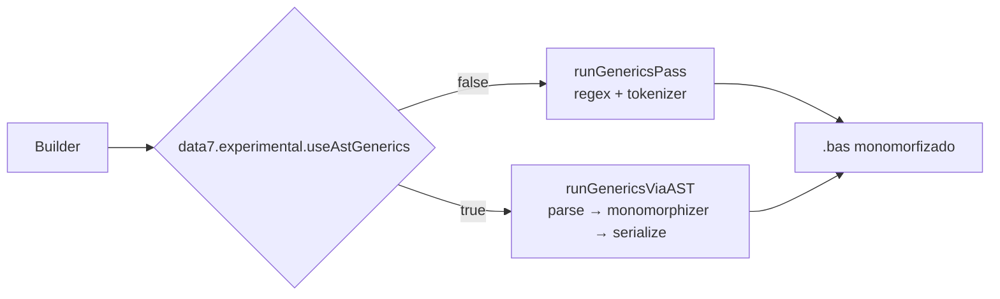
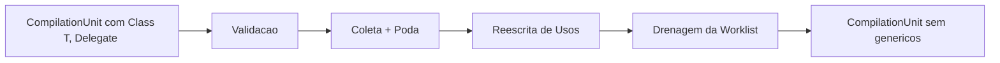

# 07 — Genéricos

> Estado atual do suporte a generics no Data7 Basic. Sintaxe alvo, mecanismo de monomorfização, limitações.
>
> **Status**: o pipeline textual ([`src/project/generics-pass.ts`](../../src/project/generics-pass.ts)) está ligado no Builder; a engine AST-based ([`src/project/generics-monomorphizer/`](../../src/project/generics-monomorphizer)) é dirigida por [`src/project/generics-driver.ts`](../../src/project/generics-driver.ts) e fica atrás da feature-flag `data7.experimental.useAstGenerics`. O linter live emite warnings (`generic-arity-mismatch`, `unknown-template`, `duplicate-template`, `class-generic-method-unsupported`, `flat-name-collision`, `instantiation-limit-exceeded`) já no design-time. IntelliSense (hover/completion/signature) sobre `TList<Product>` é resolvido pelo `WorkspaceSymbolIndexer` que injeta cópias monomórficas planas no índice de símbolos.

## Por que monomorfização

O compilador Data7 nativo **não** entende `<T>`. Para expor generics na linguagem-fonte, a extensão **monomorfiza** templates em build-time:

1. O programador escreve `Class TList<T>` no `.bas`.
2. Cada **uso** com argumentos de tipo (`TList<Product>`, `TList<Integer>`) é detectado.
3. A engine clona o template, substitui `T` pelo argumento, renomeia para um **flat name** (`TList_Product`, `TList_Integer`) e injeta no `.bas` resultante.
4. As referências no código também são reescritas para o flat name.
5. O `.7Proj` final contém apenas as classes concretas.

Esse padrão é equivalente ao C++ templates ou ao Rust monomorphization — código diferente é gerado por instanciação, e o overhead de runtime é zero.

## Sintaxe alvo

### Classe genérica

```basic
Namespace mod_list

   Class TList<T>
      Inherits TBaseList

      Sub New()
         MyBase.New()
      End Sub

      Function Add(pValue As T) As Integer
         Add = MyBase.Add(pValue)
      End Function

      Property Item(pIndex As Integer) As T
         Get
            Item = CType(MyBase.Get(pIndex), T)
         End Get
         Set(pValue As T)
            MyBase.Set(pIndex, pValue)
         End Set
      End Property

      Function Find(handler As ListFindDelegate<T>, extra As Variant) As T
         Find = CType(MyBase.Find(handler, extra), T)
      End Function

   End Class

   Delegate Function ListFindDelegate<T>(pValue As T, i As Integer, extra As Variant) As Boolean

End Namespace
```

### Uso

```basic
Imports mod_list
Imports mod_product

Dim _products As New TList<Product>()
_products.Add(New Product("1", "Coca-cola"))

Dim _filtered As TList<Product> = _products.Filter(Helper.FindByName, "Coca-cola")
Dim primeiro As Product = _filtered.Item(0)

Dim _numeros As New TList<Integer>()
_numeros.Add(1)
_numeros.Add(2)
```

### Monomorfização (saída esperada)

A partir do uso `TList<Product>` e `TList<Integer>`, o Builder gera:

```basic
' Gerado pelo monomorphizer — não editar manualmente.
Class TList_Product
   Inherits TBaseList
   Function Add(pValue As Product) As Integer ...
   Property Item(pIndex As Integer) As Product ...
   Function Find(handler As ListFindDelegate_Product, extra As Variant) As Product ...
End Class

Delegate Function ListFindDelegate_Product(pValue As Product, i As Integer, extra As Variant) As Boolean

Class TList_Integer
   Inherits TBaseList
   Function Add(pValue As Integer) As Integer ...
   Property Item(pIndex As Integer) As Integer ...
End Class

Delegate Function ListFindDelegate_Integer(pValue As Integer, i As Integer, extra As Variant) As Boolean
```

E todas as referências no código do programador são reescritas:

```basic
Dim _products As New TList_Product()
Dim _filtered As TList_Product = _products.Filter(Helper.FindByName, "Coca-cola")
Dim _numeros As New TList_Integer()
```

## Dois pipelines lado a lado

A monomorfização hoje convive em dois caminhos selecionados por feature-flag — o legado **textual** (default) e o novo **AST**, mais robusto:



| Etapa | Textual ([`generics-pass.ts`](../../src/project/generics-pass.ts)) | AST ([`generics-driver.ts`](../../src/project/generics-driver.ts)) |
|---|---|---|
| 1. Coleta de templates | Regex linha-a-linha + tokenizer (`Class T<T>`, `Delegate <T>`, `Sub/Function <T>`) | [`Parser`](../../src/project/parser/parser.ts) constrói um `CompilationUnit` completo |
| 2. Substituição de T | `instantiateTemplate` reescreve cada linha do corpo usando [`bas-tokenizer.ts`](../../src/utils/bas-tokenizer.ts) (lexically-aware) | `SubstitutionWalker` percorre a AST clonada e troca `TypeReference` + `OpaqueStatement` |
| 3. Reescrita de usos | Regex direta nas linhas de uso (incluindo invocações `obj.Foo<Product>(...)`) | `GenericsMonomorphizer.monomorphize` enfileira instâncias e dedup via `GlobalInstantiatedSet` |
| 4. Saída | Texto re-emitido pela mesma passagem | [`serializeUnit`](../../src/project/parser/serializer.ts) regenera fonte canônica |
| Warnings | Emite `GenericsPassWarning` direto | `MonomorphizationWarning` mapeado para `GenericsPassWarning` em [`generics-driver.ts`](../../src/project/generics-driver.ts) |

Os dois pipelines emitem o **mesmo conjunto de warnings** e produzem texto **funcionalmente equivalente** para os exemplos canônicos em [`docs/exemple/sugar/generic-tlist/`](../../docs/exemple/sugar/generic-tlist/). O caminho AST será o default em uma versão futura — ele fecha gaps que o textual não consegue (parsing de namespaces aninhados, generic methods dentro de classes, validação estrutural sem regex frágeis).

## Estrutura da engine AST

A engine vive em [`src/project/generics-monomorphizer/`](../../src/project/generics-monomorphizer) e expõe a fachada [`GenericsMonomorphizer`](../../src/project/generics-monomorphizer/monomorphizer.ts):

| Arquivo | Responsabilidade |
|---|---|
| `ast.ts` | Tipos AST mínimos (`ClassDeclaration`, `TypeParameter`, `TypeReference`, …) — placeholder até um parser real chegar |
| `clone.ts` | `deepClone(node)` para duplicar template antes de substituir tipos |
| `registry.ts` | `TemplateRegistry` (templates coletados) + `GlobalInstantiatedSet` (dedupe global) |
| `monomorphizer.ts` | Pipeline em 4 passos: validar → coletar/podar → reescrever usos → drenar worklist |
| `warnings.ts` | `MonomorphizationWarning` (`flat-name-collision`, `instantiation-limit-exceeded`, …) |
| `index.ts` | Re-exports públicos |

### Pipeline



1. **Validação**: nomes vazios, type-parameters duplicados, etc. emitem warnings sem abortar.
2. **Coleta & poda**: cada `Class T<T>`, `Delegate <T>`, `Sub Foo<T>` é deep-cloned para o `TemplateRegistry`, e a declaração original é **removida** do AST — o compilador downstream nunca verá `<T>`.
3. **Reescrita**: passa pelo restante do AST, encontra `TypeReference` com `typeArguments`, reescreve para o flat name e enfileira a instanciação.
4. **Drenagem**: drena a worklist (com dedup via `GlobalInstantiatedSet`); clona template, substitui `T` pelo concreto, injeta no AST. Re-walks o injetado para descobrir nested generics (`TList<TList<Integer>>` → `TList_TList_Integer`).

## Flat naming

A função `flatNameOf` em [`monomorphizer.ts`](../../src/project/generics-monomorphizer/monomorphizer.ts) padroniza os nomes:

```
flatNameOf({ name: "TList", typeArguments: [Integer] })             === "TList_Integer"
flatNameOf({ name: "Box", typeArguments: [String] })                === "Box_String"
flatNameOf({ name: "Dictionary", typeArguments: [String, Product] }) === "Dictionary_String_Product"
flatNameOf({ name: "TList", typeArguments: [TList<Integer>] })       === "TList_TList_Integer"
```

Colisões (dois templates diferentes que produziriam o mesmo flat name) emitem o warning `flat-name-collision`.

## Limitações conhecidas

| Limitação | Workaround |
|---|---|
| Sem **higher-kinded types** (`T<U>` como parâmetro) | Aceitar `T` simples; aplicar manualmente o segundo nível |
| Sem **variance annotations** (`In T`, `Out T`) | Não há cast covariante/contravariante automático; use `CType` manual |
| Sem **default type parameters** | Sempre exija que o caller forneça o tipo |
| **Constraints paramétricos** (`T As List<U>`) não são aceitos | Constraints simples (`T As BaseEnum`) são aceitas e descartadas após validação |
| **Generic methods dentro de classe** | Detectados e podados com warning `class-generic-method-unsupported` — gere `Map<T>` em namespace livre |
| **Cap de 10.000 instanciações** | Programas patológicos disparam `instantiation-limit-exceeded` |
| **Primitivos (`TList<Integer>`)** ainda em discussão (boxing vs classe específica) | Discutido em [11-limitacoes-conhecidas.md](./11-limitacoes-conhecidas.md) |

## Como o linter trata genéricos (design-time)

Antes do Builder rodar, o `WorkspaceSymbolIndexer` detecta templates (`Class T<T>`, `Delegate <T>`) + cada usage (`As TList<Product>`) e injeta cópias **monomórficas planas** (`TList_Product`) diretamente no índice de símbolos. O `TypeResolver` reconhece a forma `TList<Product>` e a normaliza para o flat name `TList_Product` em `findMember`/`findClassSymbol`/`getAllMembersForType`, então:

- **Hover** em `_products.Add(...)` mostra `Add(pValue As Product) As Integer` (com `T` substituído pelo argumento).
- **Autocomplete** em `_products.` lista todos os membros do template, com `T` resolvido — o `(pValue As Product)` aparece na linha de detalhe da label.
- **SignatureHelp** sobre `_products.Add(` exibe a assinatura substituída.
- O linter live emite os warnings `unknown-template`, `generic-arity-mismatch`, `duplicate-template`, `class-generic-method-unsupported`, `flat-name-collision` e `instantiation-limit-exceeded` enquanto o usuário digita, sem precisar rodar o Builder.

A integração não viola a fence `analysis/` ↛ `project/`: o indexador clona os membros do template já parsados (`SymbolInfo` com `containerName === "TList"`) e aplica substituição textual de `T` → `Product` em `type` e `parameters[*].type`, gerando entradas equivalentes com `containerName === "TList_Product"`.

## Gaps que esta release fecha

| Gap | Antes | Agora | Status |
|---|---|---|---|
| Substituição em variáveis locais nomeadas `T` | Reescrevia `Dim T As Integer` ⇒ `Dim Product As Integer` | `bas-tokenizer` distingue identificador em posição de tipo vs. valor; locais preservados | ✅ Fechado |
| Substituição em comentários e strings (build-time) | Regex `\bT\b` reescrevia trivia | `stripStringsAndComments` em [`generics-analyzer.ts`](../../src/analysis/generics-analyzer.ts) mascara strings/comments antes do scan; `runGenericsPass` aplica a mesma máscara em cada linha | ✅ Fechado |
| Phantom flat-copies a partir de comentários do header (e.g. `@demonstrates: Class TList<T>`) | Pipeline textual gerava `TList_T` espúrio para cada exemplo cujo header mencionava `TList<T>` | Mesma máscara acima — exemplos canônicos `_expected/*.bas` validados por golden tests | ✅ Fechado |
| Function self-reference (`Wrap = pValue`) não renomeado em template `Function Wrap<T>` | Após monomorfização para `Wrap_Integer`, o corpo ainda dizia `Wrap = pValue` → função retornava `Variant` default | Novo passe `substituteTemplateNameInBodyLine` renomeia o auto-referência lexicalmente (skipa member-access, strings, comments) | ✅ Fechado |
| Generic free functions (`Sub Foo<T>` no namespace) | Não suportado | Reconhecido e monomorfizado pelos dois pipelines | ✅ Fechado |
| Generic methods em classe (`Sub T.Foo<U>`) | Reescrita textual incorreta (corpo opaco) | Detectado e emitido `class-generic-method-unsupported`; declaração permanece verbatim — workaround: extrair para função livre no namespace | ⚠️ Detectado, sem reescrita automática |
| Linter sem feedback até build | Nenhum diagnóstico até `Build` | Seis warnings emitidos por `DiagnosticsLinter` no save (`unknown-template`, `generic-arity-mismatch`, `duplicate-template`, `class-generic-method-unsupported`, `flat-name-collision`, `instantiation-limit-exceeded`) | ✅ Fechado |
| Hover / completion / signature ignoravam tipo genérico | `_products.Add` resolvia para o template cru | Símbolos planos `TList_Product` registrados pelo `WorkspaceSymbolIndexer` (via [`collectGenericsContext`](../../src/analysis/generics-analyzer.ts)); resolver normaliza `TList<Product>` ⇒ `TList_Product` (também aninhado: `TList<TList<Integer>>` ⇒ `TList_TList_Integer`) | ✅ Fechado |
| Engine AST desconectada | Vivia órfã em `generics-monomorphizer/` | Acessível via `data7.experimental.useAstGenerics = true`; alimentada por parser próprio em [`src/project/parser/`](../../src/project/parser) | ✅ Fechado |
| Pipelines convergem para o mesmo `.bas` | N/A — só existia o textual | Golden tests em `src/test/project/generics-driver.test.ts` garantem paridade de saída e de warnings | ✅ Fechado |
| Arquitetura: parser leaf, isolado de `analysis`/`vscode` | N/A | `eslint.config.mjs` fence `data7/parser-isolation` + regra em `architecture.mdc` | ✅ Fechado |
| Fences ESLint silenciosamente desativados pela ordenação dos blocos de config | Bug pré-existente: `docs-exemple-isolation` (último, broad pattern) substituía `no-restricted-imports` de todos os layer blocks | Movido para ANTES dos layer blocks; cada layer bloco agora embute `DOCS_EXEMPLE_BAN` explicitamente | ✅ Fechado |

## Padrão de uso recomendado

1. **Defina coleções tipadas como subclasses** — não escreva `TList<T>` cru no código. Em vez disso, escreva `CardRecordList = TList<CardRecord>` ou (no futuro) `CardRecordList Inherits TList<CardRecord>`. Isso melhora mensagens de erro.
2. **Use delegates monomorfizados** — `ListFindDelegate<Product>` em vez de `TObject`-erased.
3. **Evite tipos profundamente aninhados** — `TList<Map<String, TList<Product>>>` funciona, mas o flat name fica gigante. Quebre em type aliases (planejado, vide [10-acucares-atuais.md](./10-acucares-atuais.md#planejados)).

## Cross-references

- [`src/project/generics-monomorphizer/`](../../src/project/generics-monomorphizer) — engine AST.
- [`src/project/generics-pass.ts`](../../src/project/generics-pass.ts) — pipeline textual (default).
- [`src/project/generics-driver.ts`](../../src/project/generics-driver.ts) — driver AST + mapeamento de warnings.
- [`src/project/parser/`](../../src/project/parser) — parser, lexer e serializer compartilhados.
- [`src/utils/bas-tokenizer.ts`](../../src/utils/bas-tokenizer.ts) — tokenizer lexical-aware usado pelos dois pipelines.
- [`src/analysis/symbol-indexer.ts`](../../src/analysis/symbol-indexer.ts) — injeção de cópias monomórficas planas para IntelliSense.
- [13-diagnostic-codes.md](./13-diagnostic-codes.md) — lista completa dos códigos de diagnóstico, incluindo os de generics.
- [10-acucares-atuais.md § Planejados](./10-acucares-atuais.md#planejados) — F2 (parser textual) e features dependentes (auto-new, default indexer, spread em coleção).
- [11-limitacoes-conhecidas.md](./11-limitacoes-conhecidas.md) — discussão de generics + primitivos.
- [12-convencoes-idiomaticas.md](./12-convencoes-idiomaticas.md) — padrão `TRecordList` tipado (workaround atual).
