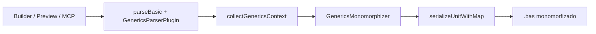

# 07 — Genéricos

> Estado atual do suporte a generics no Data7 Basic. Sintaxe alvo, mecanismo de monomorfização, limitações.
>
> **Status**: o pipeline atual usa o parser/AST central em [`src/project/parser/`](../../src/project/parser), a árvore em [`src/project/ast/`](../../src/project/ast) e o monomorfizador em [`src/project/generics/`](../../src/project/generics). O `SugarTranspiler` executa esse pipeline no build/preview/MCP, e o linter live emite warnings (`generic-arity-mismatch`, `unknown-template`, `duplicate-template`, `class-generic-method-unsupported`, `flat-name-collision`, `instantiation-limit-exceeded`) já no design-time. IntelliSense (hover/completion/signature) sobre `TList<Product>` é resolvido pelo `WorkspaceSymbolIndexer`, que injeta cópias monomórficas planas no índice de símbolos.

## Por que monomorfização

O compilador Data7 nativo **não** entende `<T>`. Para expor generics na linguagem-fonte, a extensão **monomorfiza** templates em build-time:

1. O programador escreve `Class TList<T>` no `.bas`.
2. Cada **uso** com argumentos de tipo (`TList<Product>`, `TList<Integer>`) é detectado.
3. A engine clona o template, substitui `T` pelo argumento, renomeia para um **flat name** (`TList_Product`, `TList_Integer`) e injeta no `.bas` resultante. Se o mesmo nome simples existir em mais de um namespace (`Ambient.TCampo` e `table_campo.TCampo`), o flat name inclui o qualifier (`TTList_Ambient_TCampo`, `TTList_table_campo_TCampo`) para o compilador nativo não misturar os tipos.
4. As referências no código também são reescritas para o flat name.
5. O `.7Proj` final contém apenas as classes concretas.

Esse padrão é equivalente ao C++ templates ou ao Rust monomorphization — código diferente é gerado por instanciação, e o overhead de runtime é zero.

## Sintaxe alvo

### Classe genérica

```basic
Namespace mod_list

   Class TList<T>
      Inherits TBaseList

      Sub New()
         MyBase.New()
      End Sub

      Function Add(pValue As T) As Integer
         Add = MyBase.Add(pValue)
      End Function

      Property Item(pIndex As Integer) As T
         Get
            Item = CType(MyBase.Get(pIndex), T)
         End Get
         Set(pValue As T)
            MyBase.Set(pIndex, pValue)
         End Set
      End Property

      Function Find(handler As ListFindDelegate<T>, extra As Variant) As T
         Find = CType(MyBase.Find(handler, extra), T)
      End Function

   End Class

   Delegate Function ListFindDelegate<T>(pValue As T, i As Integer, extra As Variant) As Boolean

End Namespace
```

### Método genérico (inclusive Shared na classe)

Métodos aceitam type parameters, com constraint opcional `T As Type` (só aquele tipo ou um subtipo). Dentro do método, um valor `As T` expõe os membros de `Type`. Shared declarado na classe base é chamável pelo nome do tipo derivado:

```basic
Class TTable
   Function Exists(pWhere As String) As Boolean
      Exists = TSql.ExistsFlag(...)
   End Function

   Shared Function Exists<T As TTable>(pWhere As String) As Boolean
      Dim probe As New T()
      Dim ok As Boolean = probe.Exists(pWhere)
      probe.Free()
      Exists = ok
   End Function

   Shared Function Fetch<T As TTable>(pWhere As String) As TTList<T>
      Dim probe As New T()
      Dim raw[] As TTable = probe.FetchRows(pWhere)
      ...
   End Function
End Class

Class TTestPedido
   Inherits TTable
End Class

Dim ok As Boolean = TTestPedido.Exists<TTestPedido>("Titulo = 'A'")
```

`Exists(pWhere)` (instância) e `Exists<T As TTable>(pWhere)` (Shared) são overloads distintos — a aridade genérica faz parte da assinatura.

No build, a chamada no nome da classe (`Cache.Find<Forms.Form>(...)`, ou no tipo derivado) materializa o overload na classe que declara o método, mesmo quando o uso está em outro `.bas`. O flat name do método inclui o namespace do argumento: `Find<Forms.Form>` vira `Find_Forms_Form` e `Find<MeusForms.Form>` vira `Find_MeusForms_Form`. `Exists<TTestPedido>` (sem namespace) continua `Exists_TTestPedido`. O cast de tipo `T(obj, )` permanece com a vírgula final (`Forms.Form(obj, )`).

### Uso

```basic
Imports mod_list
Imports mod_product

Dim _products As New TList<Product>()
_products.Add(New Product("1", "Coca-cola"))

Dim _filtered As TList<Product> = _products.Filter(Helper.FindByName, "Coca-cola")
Dim primeiro As Product = _filtered.Item(0)

Dim _numeros As New TList<Integer>()
_numeros.Add(1)
_numeros.Add(2)
```

### Monomorfização (saída esperada)

A partir do uso `TList<Product>` e `TList<Integer>`, o Builder gera:

```basic
' Gerado pelo monomorphizer — não editar manualmente.
Class TList_Product
   Inherits TBaseList
   Function Add(pValue As Product) As Integer ...
   Property Item(pIndex As Integer) As Product ...
   Function Find(handler As ListFindDelegate_Product, extra As Variant) As Product ...
End Class

Delegate Function ListFindDelegate_Product(pValue As Product, i As Integer, extra As Variant) As Boolean

Class TList_Integer
   Inherits TBaseList
   Function Add(pValue As Integer) As Integer ...
   Property Item(pIndex As Integer) As Integer ...
End Class

Delegate Function ListFindDelegate_Integer(pValue As Integer, i As Integer, extra As Variant) As Boolean
```

E todas as referências no código do programador são reescritas:

```basic
Dim _products As New TList_Product()
Dim _filtered As TList_Product = _products.Filter(Helper.FindByName, "Coca-cola")
Dim _numeros As New TList_Integer()
```

## Pipeline atual

A monomorfização hoje passa pelo mesmo kernel de linguagem usado por linter, indexer, preview e MCP:


```mermaid
flowchart LR
  Build[Builder / Preview / MCP]
  Parse[parseBasic + GenericsParserPlugin]
  Collect[collectGenericsContext]
  Mono[GenericsMonomorphizer]
  Serialize[serializeUnitWithMap]
  Out[".bas monomorfizado"]

  Build --> Parse --> Collect --> Mono --> Serialize --> Out
```

| Etapa | Implementação atual |
|---|---|
| 1. Parse | [`parseBasic`](../../src/project/parser/index.ts) com [`GenericsParserPlugin`](../../src/project/parser/generics-plugin.ts) constrói um `CompilationUnit`. |
| 2. Coleta de contexto | [`collectGenericsContext`](../../src/analysis/generics-analyzer.ts) coleta templates e usos para diagnósticos e materialização externa. |
| 3. Monomorfização | [`GenericsMonomorphizer`](../../src/project/generics/monomorphizer.ts) valida, poda templates, reescreve usos e drena a worklist. |
| 4. Saída | [`serializeUnitWithMap`](../../src/project/parser/serializer.ts) regenera fonte canônica e preserva mapa de linhas para preview. |
| Warnings | [`MonomorphizationWarning`](../../src/project/generics/warnings.ts) é mapeado para diagnósticos do transpilador e do linter. |

Os exemplos canônicos em [`docs/example/sugar/generic-tlist/`](../../docs/example/sugar/generic-tlist/) são fixtures do output real desse pipeline.

## Estrutura da engine AST

A engine vive em [`src/project/generics/`](../../src/project/generics) e expõe a fachada [`GenericsMonomorphizer`](../../src/project/generics/monomorphizer.ts):

| Arquivo | Responsabilidade |
|---|---|
| `../ast/ast.ts` | Tipos AST centrais (`ClassDeclaration`, `TypeParameter`, `TypeReference`, …) consumidos por parser, linter, providers e transpiler |
| `../ast/clone.ts` | `deepClone(node)` para duplicar template antes de substituir tipos |
| `registry.ts` | `TemplateRegistry` (templates coletados) + `GlobalInstantiatedSet` (dedupe global) |
| `monomorphizer.ts` | Pipeline em 4 passos: validar → coletar/podar → reescrever usos → drenar worklist |
| `warnings.ts` | `MonomorphizationWarning` (`flat-name-collision`, `instantiation-limit-exceeded`, …) |
| `index.ts` | Re-exports públicos |

### Pipeline


```mermaid
flowchart LR
  Input["CompilationUnit com Class T<T>, Delegate <T>"]
  Validate[Validacao]
  Collect[Coleta + Poda]
  Rewrite[Reescrita de Usos]
  Drain[Drenagem da Worklist]
  Output["CompilationUnit sem genericos"]

  Input --> Validate --> Collect --> Rewrite --> Drain --> Output
```

1. **Validação**: nomes vazios, type-parameters duplicados, etc. emitem warnings sem abortar.
2. **Coleta & poda**: cada `Class T<T>`, `Delegate <T>`, `Sub Foo<T>` é deep-cloned para o `TemplateRegistry`, e a declaração original é **removida** do AST — o compilador downstream nunca verá `<T>`.
3. **Reescrita**: passa pelo restante do AST, encontra `TypeReference` com `typeArguments`, reescreve para o flat name e enfileira a instanciação.
4. **Drenagem**: drena a worklist (com dedup via `GlobalInstantiatedSet`); clona template, substitui `T` pelo concreto, injeta no AST. Re-walks o injetado para descobrir nested generics **no mesmo arquivo** (`TList<TList<Integer>>` → `TList_TList_Integer`). Usos aninhados de templates **de outro arquivo** (`TTList<TypeRow>` dentro de `TTMatrix<TypeRow>`) são fechados na coleta global do Builder: a instanciação concreta do template externo entra na fila (`TTList_TGridRow`) para o arquivo dono materializar a classe.

## Flat naming

A função `flatNameOf` em [`monomorphizer.ts`](../../src/project/generics/monomorphizer.ts) padroniza os nomes:

```
flatNameOf({ name: "TList", typeArguments: [Integer] })             === "TList_Integer"
flatNameOf({ name: "Box", typeArguments: [String] })                === "Box_String"
flatNameOf({ name: "Dictionary", typeArguments: [String, Product] }) === "Dictionary_String_Product"
flatNameOf({ name: "TList", typeArguments: [TList<Integer>] })       === "TList_TList_Integer"
```

Colisões (dois templates diferentes que produziriam o mesmo flat name) emitem o warning `flat-name-collision`.

## Limitações conhecidas

| Limitação | Workaround |
|---|---|
| Sem **higher-kinded types** (`T<U>` como parâmetro) | Aceitar `T` simples; aplicar manualmente o segundo nível |
| Sem **variance annotations** (`In T`, `Out T`) | Não há cast covariante/contravariante automático; use `CType` manual |
| Sem **default type parameters** | Sempre exija que o caller forneça o tipo |
| **Constraints paramétricos** (`T As List<U>`) não são aceitos | Constraints simples (`T As TEnum`) são aceitas; o linter exige o tipo ou um subtipo no uso |
| **Generic methods dentro de classe** | Suportados (`Shared Function Exists<T As TTable>(...)`); a classe derivada pode chamar o Shared da base (`TTestPedido.Exists<TTestPedido>(...)`) |
| **Cap de 10.000 instanciações** | Programas patológicos disparam `instantiation-limit-exceeded` |
| **Primitivos (`TList<Integer>`)** geram classe plana (`TList_Integer`) | Use quando o runtime aceitar o valor concreto; não há boxing genérico nativo |

## Como o linter trata genéricos (design-time)

Antes do Builder rodar, o `WorkspaceSymbolIndexer` detecta templates (`Class T<T>`, `Delegate <T>`) + cada usage (`As TList<Product>`) e injeta cópias **monomórficas planas** (`TList_Product`) diretamente no índice de símbolos. O `TypeResolver` reconhece a forma `TList<Product>` e a normaliza para o flat name `TList_Product` em `findMember`/`findClassSymbol`/`getAllMembersForType`, então:

- **Hover** em `_products.Add(...)` mostra `Add(pValue As Product) As Integer` (com `T` substituído pelo argumento).
- **Autocomplete** em `_products.` lista todos os membros do template, com `T` resolvido — o `(pValue As Product)` aparece na linha de detalhe da label.
- **SignatureHelp** sobre `_products.Add(` exibe a assinatura substituída.
- O linter live emite `unknown-template`, `generic-arity-mismatch`, `duplicate-template`, `flat-name-collision`, `instantiation-limit-exceeded` e `generic-constraint-violated` enquanto o usuário digita, sem precisar rodar o Builder. Métodos genéricos de classe (`Sub Foo<T>` / `Shared Function Exists<T As TTable>`) são analisados no design-time: `T` resolve para o constraint, overloads distinguem aridade genérica, e Shared da classe base é visível pelo nome do tipo derivado.

A integração não viola a fence `analysis/` ↛ `project/`: o indexador clona os membros do template já parsados (`SymbolInfo` com `containerName === "TList"`) e aplica substituição textual de `T` → `Product` em `type` e `parameters[*].type`, gerando entradas equivalentes com `containerName === "TList_Product"`.

## Gaps que esta release fecha

| Gap | Antes | Agora | Status |
|---|---|---|---|
| Substituição em variáveis locais nomeadas `T` | Reescrevia `Dim T As Integer` ⇒ `Dim Product As Integer` | [`substituteTypeParamsInLine`](../../src/project/generics/substitute.ts) usa tokens do lexer para distinguir posição de tipo vs. valor; locais preservados | ✅ Fechado |
| Substituição em comentários e strings (build-time) | Regex `\bT\b` reescrevia trivia | [`stripStringsAndComments`](../../src/analysis/generics-analyzer.ts) mascara strings/comments antes do scan; o substituidor também usa tokens do lexer | ✅ Fechado |
| Phantom flat-copies a partir de comentários do header (e.g. `@demonstrates: Class TList<T>`) | Pipeline textual gerava `TList_T` espúrio para cada exemplo cujo header mencionava `TList<T>` | Mesma máscara acima — exemplos canônicos `_expected/*.bas` validados por golden tests | ✅ Fechado |
| Function self-reference (`Wrap = pValue`) não renomeado em template `Function Wrap<T>` | Após monomorfização para `Wrap_Integer`, o corpo ainda dizia `Wrap = pValue` → função retornava `Variant` default | Novo passe `substituteTemplateNameInBodyLine` renomeia o auto-referência lexicalmente (skipa member-access, strings, comments) | ✅ Fechado |
| Generic free functions (`Sub Foo<T>` no namespace) | Não suportado | Reconhecido e monomorfizado pelos dois pipelines | ✅ Fechado |
| Generic methods em classe (`Sub T.Foo<U>`) | Reescrita textual incorreta (corpo opaco) | Monomorfizados quando invocados; linter resolve `T As Type`, overloads `Foo` vs `Foo<T>`, e Shared herdado (`TTestPedido.Exists<TTestPedido>`) | ✅ Fechado |
| Linter sem feedback até build | Nenhum diagnóstico até `Build` | Seis warnings emitidos por `DiagnosticsLinter` no save (`unknown-template`, `generic-arity-mismatch`, `duplicate-template`, `class-generic-method-unsupported`, `flat-name-collision`, `instantiation-limit-exceeded`) | ✅ Fechado |
| Hover / completion / signature ignoravam tipo genérico | `_products.Add` resolvia para o template cru | Símbolos planos `TList_Product` registrados pelo `WorkspaceSymbolIndexer` (via [`collectGenericsContext`](../../src/analysis/generics-analyzer.ts)); resolver normaliza `TList<Product>` ⇒ `TList_Product` (também aninhado: `TList<TList<Integer>>` ⇒ `TList_TList_Integer`) | ✅ Fechado |
| Engine AST desconectada | Vivia em protótipo separado | Integrada ao `SugarTranspiler`, alimentada por [`src/project/parser/`](../../src/project/parser) e validada por [`generics-monomorphizer.test.ts`](../../src/test/project/generics-monomorphizer.test.ts) | ✅ Fechado |
| Pipeline textual paralelo | Duplicava decisões semânticas | Removido da documentação operacional; a fonte real é parser + AST + monomorfizador | ✅ Fechado |
| Arquitetura: parser leaf, isolado de `analysis`/`vscode` | N/A | `eslint.config.mjs` fence `data7/parser-isolation` + regra em `architecture.mdc` | ✅ Fechado |
| Fences ESLint silenciosamente desativados pela ordenação dos blocos de config | Bug pré-existente: `docs-example-isolation` (último, broad pattern) substituía `no-restricted-imports` de todos os layer blocks | Movido para ANTES dos layer blocks; cada layer bloco agora embute `DOCS_example_BAN` explicitamente | ✅ Fechado |

## Metaprogramação em templates (`TypeSystem.*`)

Dentro de templates genéricos, diretivas `<# IF ... THEN #>`, `<# ElseIf ... Then #>` (também `<# Else If ... Then #>`), `<# ELSE #>` e `<# END IF #>` são avaliadas **depois** da substituição dos argumentos concretos. O corpo inativo é descartado na materialização. A cadeia é exclusiva: o primeiro ramo verdadeiro vence; `Else` só entra se nenhum `If`/`ElseIf` anterior foi tomado.

Expressões suportadas (todas aceitam `NOT`):

| Expressão | Uso |
|---|---|
| `TypeSystem.InheritsFrom(T, "Base")` | `T` é `Base` ou descendente. O lookup usa o nome qualificado do argumento (`mod_tfield.TField`) e não pode resolver um homônimo de outro namespace (`SQL.TField`). |
| `TypeSystem.IsType(T, "MemoTextBox")` | `T` é exatamente esse tipo (nome simples ou qualificado). Não inclui subclasses — para isso use `InheritsFrom`. Diretivas também valem em membros de classe (`Property`/`Sub`), não só no corpo de métodos. |
| `TypeSystem.IsKind(T, "Delegate")` | kind do argumento concreto |
| `TypeSystem.IsDelegate(T)` | atalho de `IsKind(T, "Delegate")` |
| `TypeSystem.IsClass(T)` / `IsStructure(T)` / `IsPrimitive(T)` / `IsEnum(T)` | atalhos equivalentes |
| `A And B` / `A Or B` / `Not A` / `(A And Not B)` | combinação booleana das expressões acima (precedência: `Not` > `And` > `Or`) |

Kinds válidos em `IsKind`: `Class`, `Delegate`, `Structure`, `Primitive`, `Enum`, `Unknown`.

```basic
Class TBox_<T>
   Function Describe() As String
      <# IF TypeSystem.IsDelegate(T) THEN #>
      Describe = "delegate"
      <# ELSE #>
      Describe = "value"
      <# END IF #>
   End Function
End Class

Dim a As TBox<THandler<Integer>>   ' materializa o ramo delegate
Dim b As TBox<Integer>             ' materializa o ramo value
```

Para o tipo concreto (não a cadeia de herança), use `IsType`. O bloco abaixo só entra quando `T` é exatamente `MemoTextBox`, não um descendente:

```basic
Class TLabeled<T>
   <# If Not TypeSystem.IsType(T, "MemoTextBox") Then #>
   Property CharCase As Integer
      Get
         CharCase = 0
      End Get
      Set(pValue As Integer)
      End Set
   End Property
   <# End If #>
End Class
```

Vide [`01-typesystem-is-type.bas`](../example/sugar/generics/01-typesystem-is-type.bas).

`And` / `Or` / `Not` combinam átomos na mesma cláusula. Encadeie ramos com `ElseIf` (ou `Else If`) em vez de aninhar `If`/`Else`:

```basic
<# If TypeSystem.IsType(T, "CheckBox") Then #>
Label = "check"
<# ElseIf TypeSystem.InheritsFrom(T, "TcxCustomTextEdit") And Not TypeSystem.IsType(T, "Forms.CheckBox") Then #>
Label = "text"
<# Else #>
Label = "other"
<# End If #>
```

Vide [`02-typesystem-elseif.bas`](../example/sugar/generics/02-typesystem-elseif.bas).

## Padrão de uso recomendado

1. **Defina coleções tipadas como subclasses** — `Class TTesteItens Inherits TTList<TTesteItem>` (ou alias `CardRecordList = TList<CardRecord>`). O linter trata `me.Take(0)` / `me.Last()` nessa subclasse como o elemento concreto (`TTesteItem`), não o parâmetro aberto `T` — vide [`08-subclass-element-members.bas`](../example/sugar/array-list/08-subclass-element-members.bas).
2. **Use delegates monomorfizados** — `ListFindDelegate<Product>` em vez de `TObject`-erased.
3. **Evite tipos profundamente aninhados** — `TList<Map<String, TList<Product>>>` funciona, mas o flat name fica gigante. Quebre em aliases/convenções nomeadas quando a legibilidade do `.bas` final importar.
4. **Ramifique em build-time quando o template precisar de caminhos distintos** — `TypeSystem.IsType(T, "MemoTextBox")` para o tipo final, `InheritsFrom` para a hierarquia, `IsDelegate`/`IsPrimitive` para o kind. Combine com `And`/`Or`/`Not` na mesma `<# If #>` e encadeie com `<# ElseIf ... Then #>`. Evite checagens runtime equivalentes.

## Cross-references

- [`src/project/generics/`](../../src/project/generics) — engine de monomorfização.
- [`src/project/parser/`](../../src/project/parser) — parser, lexer e serializer compartilhados.
- [`src/project/ast/`](../../src/project/ast) — tipos e helpers da AST central.
- [`src/analysis/symbol-indexer.ts`](../../src/analysis/symbol-indexer.ts) — injeção de cópias monomórficas planas para IntelliSense.
- [13-diagnostic-codes.md](./13-diagnostic-codes.md) — lista completa dos códigos de diagnóstico, incluindo os de generics.
- [10-acucares-atuais.md](./10-acucares-atuais.md) — sugars e convenções que interagem com generics.
- [11-limitacoes-conhecidas.md](./11-limitacoes-conhecidas.md) — discussão de generics + primitivos.
- [12-convencoes-idiomaticas.md](./12-convencoes-idiomaticas.md) — padrão `TTList` tipado (workaround atual).
