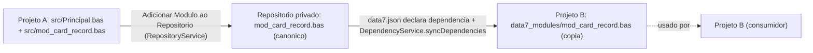

# 08 — Módulos e Imports

> Como a unidade de organização (módulo) funciona, como `Imports` resolve namespaces, e como o repositório privado de módulos compartilhados se integra.

## Arquivos como módulos

Cada `.bas` é uma **unidade de compilação**. Por convenção:

- Nome do arquivo = nome do namespace = nome do módulo. `mod_card_record.bas` declara `Namespace mod_card_record`.
- Prefixo `mod_` é convenção idiomática para módulos compartilháveis (não é obrigatório, mas universal).
- Um `.bas` declara **exatamente um** `Namespace` no topo.

```basic
'@Module

Imports mod_pipeline_record
Imports Collections

Namespace mod_card_record
   ' classes, delegates, etc.
End Namespace
```

## `Imports`

A diretiva `Imports <Namespace>` traz todos os símbolos públicos de um namespace para o escopo do arquivo atual:

```basic
Imports Collections           ' StringList, TStrings, TStringList
Imports SQL                   ' Connection, Command, TField, ...
Imports Data7                 ' Report, Parametro, ProximoID, ...
Imports mod_card_record       ' CardRecord, CardRecordList, ...
```

Regras:

- **Todos os `Imports` ficam no topo do arquivo**, antes do `Namespace`. Convenção: um por linha.
- A ordem visual não importa para semântica, mas blocos típicos vão System Library primeiro, depois módulos do workspace.
- Diretiva duplicada dispara [`duplicate-import`](./13-diagnostic-codes.md#duplicate-import).
- Diretiva inútil (nenhum símbolo do namespace é usado) dispara [`unused-import`](./13-diagnostic-codes.md#unused-import).
- Referência a símbolo de namespace não importado dispara [`missing-import`](./13-diagnostic-codes.md#missing-import) — e o Code Action "Importar `<Namespace>`" adiciona automaticamente.

### Qualificação explícita

Pode-se referenciar um símbolo sem `Imports` usando o nome qualificado:

```basic
Dim parser As mod_xml.XMLParser = ...    ' sem Imports mod_xml
```

Mas isso é raro — `Imports` é o caminho idiomático.

### `Principal.bas`

`Principal.bas` é o **ponto de entrada** do projeto. Tudo que está declarado nele é **automaticamente injetado no escopo global** — visível em todos os outros arquivos sem necessidade de `Imports`.

Estrutura típica:

```basic
Imports mod_card_form
Imports Collections

Dim _form As New TFormCard("Processar retorno de cartões")
_form.Show()
_form.Free()
```

- Declarações de topo (`Dim`, classes, funções) são globais.
- `Imports` em `Principal.bas` se aplicam só ao `Principal.bas` (não vazam para outros arquivos).

## Modos de módulo: `@Module`, `@Module-Imported`, local

Comentários no header determinam o status:

| Tag | Tipo | Significado |
|---|---|---|
| `'@Module` | Compartilhável (canônico) | Pode ser importado em outros projetos; vive no repositório privado. Reexportável. |
| `'@Module-Imported` | Cópia importada | Cópia local em `data7_modules/`; **não** reexportável; o canônico vive no repositório privado. |
| (sem tag) | Local | Apenas para esse projeto; nunca exportado. |

```basic
'@Module
' Módulo compartilhável de processamento de cartões.

Namespace mod_card_record
   ' ...
End Namespace
```

```basic
'@Module-Imported
' Cópia local — não editar manualmente.

Namespace mod_pipeline_field
   ' ...
End Namespace
```

## `data7.json` — manifesto do projeto

Cada projeto tem um `data7.json` na raiz declarando metadata + dependências:

```json
{
   "nome": "forms",
   "version": "1.0.0.0",
   "module": {
      "enabled": true,
      "name": "forms",
      "repository": "matheusdevelope/data7-modules"
   },
   "dependencies": {
      "mod_pipeline_form": "1.0.0.0",
      "mod_card_record": "2.1.0.0"
   }
}
```

Cada entrada de `dependencies` é o nome de um módulo compartilhado disponível no catálogo local ou online, associado à versão instalada. O bloco opcional `module` marca o projeto como publicável e define `module.name` como nome canônico do pacote. O `ModuleOrchestrator` da extensão segue o modelo do NPM:

1. `install` aceita um ou mais módulos, resolve a versão disponível e grava `data7.json#dependencies`.
2. `update` compara a versão instalada com a versão disponível no repositório local ou online e atualiza o manifesto quando houver versão mais nova.
3. `remove` exclui um ou mais módulos de `dependencies`.
4. Após cada operação, `data7_modules/` é sincronizado para refletir exatamente o manifesto.
5. Instalar um módulo cujo nome corresponde a `module.name` ou `nome` do projeto ativo é bloqueado.
6. O construtor marca os arquivos copiados com `'@Module-Imported`.

Ao publicar online, a extensão consulta o catálogo público antes de autenticar no GitHub. Se o módulo já existe e o conteúdo local é igual ao publicado, a publicação é bloqueada como repetida. Se há alteração local, a versão em `version`/`opcoes.versao` precisa ser maior que a versão já publicada. O manifesto enviado ao repositório online recebe `module.publisher` com o login GitHub autenticado.

O comando de unpublish online remove a pasta `modules/<modulo>` em um fork e abre um PR de remoção. A extensão bloqueia a operação quando o usuário autenticado não é o `module.publisher` do manifesto publicado nem o dono do repositório de módulos.

Quando um projeto recebido de terceiros ja contem uma copia local em `data7_modules/`
marcada com `'@Module` ou `'@Module-Imported`, mas o namespace ainda nao existe no
repositorio/core local, a extensao preserva essa copia e a entrada correspondente em
`data7.json#dependencies`. Ao decompor um `.7Proj`, modulos de dependencia
desconhecidos tambem sao materializados em `data7_modules/` para evitar perda de codigo.

## Repositórios de módulos

O catálogo de módulos é separado por origem:

- **Local**: `~/.data7/local_modules`, usado para módulos privados ou em desenvolvimento publicados localmente.
- **Online**: repositório GitHub configurado pela extensão, usado para módulos públicos. Apenas releases com tag no formato `<modulo>-v<versao>` entram no catálogo e podem ser instaladas/atualizadas.
- **Cache online**: a extensão faz uma consulta pública de releases no início e mantém cache por intervalo longo, com revalidação periódica, para reduzir chamadas à API do GitHub.
- **Instalação**: quando o mesmo módulo existir nas duas origens, a instalação/sincronização prioriza a origem local.
- **Sidebar**: o Gerenciador de Módulos lista as origens local e online separadamente, mostra módulos instalados/atualizáveis e permite ações em lote por checkbox.
- **Segurança**: `.bas`, `.7proj`, manifesto e módulos externos devem ser tratados como entrada não confiável; operações de escrita permanecem confinadas ao workspace ativo, `data7_modules/` ou aos repositórios gerenciados.



## Diagnósticos relacionados

| Código | Significado |
|---|---|
| [`missing-import`](./13-diagnostic-codes.md#missing-import) | Tipo de outro namespace usado sem `Imports`. Code Action: adicionar `Imports`. |
| [`unused-import`](./13-diagnostic-codes.md#unused-import) | `Imports` declarado mas nenhum símbolo usado. Code Action: remover linha. |
| [`duplicate-import`](./13-diagnostic-codes.md#duplicate-import) | Mesmo `Imports` declarado duas vezes. Code Action: remover duplicata. |
| [`module-not-found`](./13-diagnostic-codes.md#module-not-found) | `Imports mod_x` mas `mod_x` não existe nem no workspace, nem no repositório, nem na System Library. Code Action: instalar módulo (se possível). |
| [`module-not-declared`](./13-diagnostic-codes.md#module-not-declared) | Módulo existe no repositório mas não consta em `data7.json#dependencies`. Code Action: adicionar à `dependencies`. |

## Cross-references

- [`docs/example/diagnostics/missing-import/`](../example/diagnostics/missing-import) — exemplos canônicos.
- [`docs/example/diagnostics/module-not-found/`](../example/diagnostics/module-not-found).
- [`docs/example/diagnostics/module-not-declared/`](../example/diagnostics/module-not-declared).
- [`src/services/repository-service.ts`](../../src/services/repository-service.ts) — gerenciamento do repositório.
- [`src/services/dependency-service.ts`](../../src/services/dependency-service.ts) — sincronização de dependências.
- [01-sintaxe.md § Tags semânticas](./01-sintaxe.md#tags-semânticas) — detalhes das tags `@Module`/`@Module-Imported`.
