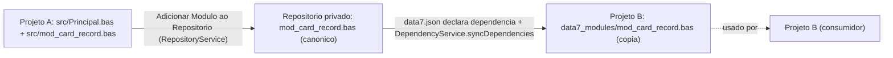

# 08 — Módulos e Imports

> Como a unidade de organização (módulo) funciona, como `Imports` resolve namespaces, e como o repositório privado de módulos compartilhados se integra.

## Arquivos como módulos

Cada `.bas` é uma **unidade de compilação**. Por convenção:

- Nome do arquivo = nome do namespace = nome do módulo. `mod_card_record.bas` declara `Namespace mod_card_record`.
- Prefixo `mod_` é convenção idiomática para módulos compartilháveis (não é obrigatório, mas universal).
- Um `.bas` declara **exatamente um** `Namespace` no topo.

```basic
'@Module

Imports mod_pipeline_record
Imports Collections

Namespace mod_card_record
   ' classes, delegates, etc.
End Namespace
```

## `Imports`

A diretiva `Imports <Namespace>` traz todos os símbolos públicos de um namespace para o escopo do arquivo atual:

```basic
Imports Collections           ' StringList, TStrings, TStringList
Imports SQL                   ' Connection, Command, TField, ...
Imports Data7                 ' Report, Parametro, ProximoID, ...
Imports mod_card_record       ' CardRecord, CardRecordList, ...
```

Regras:

- **Todos os `Imports` ficam no topo do arquivo**, antes do `Namespace`. Convenção: um por linha.
- A ordem visual não importa para semântica, mas blocos típicos vão System Library primeiro, depois módulos do workspace.
- Diretiva duplicada dispara [`duplicate-import`](./13-diagnostic-codes.md#duplicate-import).
- Diretiva inútil (nenhum símbolo do namespace é usado) dispara [`unused-import`](./13-diagnostic-codes.md#unused-import).
- Referência a símbolo de namespace não importado dispara [`missing-import`](./13-diagnostic-codes.md#missing-import) — e o Code Action "Importar `<Namespace>`" adiciona automaticamente.

### Qualificação explícita

Pode-se referenciar um símbolo sem `Imports` usando o nome qualificado:

```basic
Dim parser As mod_xml.XMLParser = ...    ' sem Imports mod_xml
```

Mas isso é raro — `Imports` é o caminho idiomático.

### `Principal.bas`

`Principal.bas` é o **ponto de entrada** do projeto. Tudo que está declarado nele é **automaticamente injetado no escopo global** — visível em todos os outros arquivos sem necessidade de `Imports`.

Estrutura típica:

```basic
Imports mod_card_form
Imports Collections

Dim _form As New TFormCard("Processar retorno de cartões")
_form.Show()
_form.Free()
```

- Declarações de topo (`Dim`, classes, funções) são globais.
- `Imports` em `Principal.bas` se aplicam só ao `Principal.bas` (não vazam para outros arquivos).

## Modos de módulo: `@Module`, `@Module-Imported`, local

Comentários no header determinam o status:

| Tag | Tipo | Significado |
|---|---|---|
| `'@Module` | Compartilhável (canônico) | Pode ser importado em outros projetos; vive no repositório privado. Reexportável. |
| `'@Module-Imported` | Cópia importada | Cópia local em `data7_modules/`; **não** reexportável; o canônico vive no repositório privado. |
| (sem tag) | Local | Apenas para esse projeto; nunca exportado. |

```basic
'@Module
' Módulo compartilhável de processamento de cartões.

Namespace mod_card_record
   ' ...
End Namespace
```

```basic
'@Module-Imported
' Cópia local — não editar manualmente.

Namespace mod_pipeline_field
   ' ...
End Namespace
```

## `data7.json` — manifesto do projeto

Cada projeto tem um `data7.json` na raiz declarando metadata + dependências:

```json
{
   "name": "MeuProjeto",
   "version": "1.0.0",
   "description": "Processamento de retorno de cartões.",
   "dependencies": [
      "mod_pipeline_form",
      "mod_pipeline_controller",
      "mod_pipeline_record",
      "mod_pipeline_grouper",
      "mod_card_record",
      "mod_enum",
      "mod_base_list"
   ]
}
```

Cada entrada de `dependencies` é o nome de um módulo `@Module` que vive no **repositório privado** (vide próxima seção). O `DependencyService` da extensão:

1. Lê `data7.json#dependencies`.
2. Para cada módulo declarado, copia a versão canônica do repositório privado para `data7_modules/` no workspace.
3. Marca o `.bas` copiado com `'@Module-Imported`.
4. Adiciona `data7_modules/` ao `.gitignore` (não é versionado).

## Repositório privado de módulos

Pasta isolada gerenciada pela extensão:

- **Localização**: `vscode.ExtensionContext.globalStorageUri` (no Windows: `%APPDATA%\Code\User\globalStorage\<publisher>.<extension>\`). Fallback: `~/.data7_extension/repository`.
- **Conteúdo**: cópias canônicas de cada módulo `@Module` importado de outros projetos.
- **Quem gerencia**: `RepositoryService` (o único componente autorizado a escrever lá — fence em [`governance.mdc`](../../.cursor/rules/governance.mdc)).
- **Segurança**: toda escrita passa por `safeJoinInside` (vide [`src/utils/path-safety.ts`](../../src/utils/path-safety.ts)) para impedir path-traversal a partir de nomes controlados por XML.



## Diagnósticos relacionados

| Código | Significado |
|---|---|
| [`missing-import`](./13-diagnostic-codes.md#missing-import) | Tipo de outro namespace usado sem `Imports`. Code Action: adicionar `Imports`. |
| [`unused-import`](./13-diagnostic-codes.md#unused-import) | `Imports` declarado mas nenhum símbolo usado. Code Action: remover linha. |
| [`duplicate-import`](./13-diagnostic-codes.md#duplicate-import) | Mesmo `Imports` declarado duas vezes. Code Action: remover duplicata. |
| [`module-not-found`](./13-diagnostic-codes.md#module-not-found) | `Imports mod_x` mas `mod_x` não existe nem no workspace, nem no repositório, nem na System Library. Code Action: instalar módulo (se possível). |
| [`module-not-declared`](./13-diagnostic-codes.md#module-not-declared) | Módulo existe no repositório mas não consta em `data7.json#dependencies`. Code Action: adicionar à `dependencies`. |

## Cross-references

- [`docs/exemple/diagnostics/missing-import/`](../exemple/diagnostics/missing-import) — exemplos canônicos.
- [`docs/exemple/diagnostics/module-not-found/`](../exemple/diagnostics/module-not-found).
- [`docs/exemple/diagnostics/module-not-declared/`](../exemple/diagnostics/module-not-declared).
- [`src/services/repository-service.ts`](../../src/services/repository-service.ts) — gerenciamento do repositório.
- [`src/services/dependency-service.ts`](../../src/services/dependency-service.ts) — sincronização de dependências.
- [01-sintaxe.md § Tags semânticas](./01-sintaxe.md#tags-semânticas) — detalhes das tags `@Module`/`@Module-Imported`.
