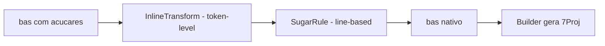

# 10 — Açúcares sintáticos

> Açúcares (sugars) opcionais adicionados pela extensão `vscode-extension-data7`. O `.bas` em `src/` mantém o açúcar; só o `.7Proj` final recebe a forma nativa expandida.

## Arquitetura

> Contrato atual: `transpiler.ts` é uma fachada e `transpiler-orchestrator.ts` coordena os plugins. Cada sugar deve ser isolado em `src/project/sugars/plugins/<id>/`, onde ficam parser, transformação, diagnósticos, tipos e utilitários da feature. `SugarEngine` é a única autoridade para habilitar IDs; quando uma feature estiver desabilitada, sua sintaxe deve ser preservada sem perda. Detalhes em [`docs/sugar-architecture.md`](../sugar-architecture.md).

[`src/project/transpiler.ts`](../../src/project/transpiler.ts) implementa o motor que aplica os açúcares em ordem definida:



| Tipo | Quando casa | Exemplo |
|---|---|---|
| `InlineTransform` | qualquer coluna na linha (token-level) | string interpolation `$"..."` |
| `SugarRule` | a linha inteira casa o padrão | `For Each x In list ...` |

Ordem importa: o `for-each-range` (`0..N`) é avaliado **antes** do `for-each` genérico para evitar que `0..N` seja interpretado como tipo enumerável.

Quando um açúcar falha (sintaxe reconhecida mas não expansível), a linha é **preservada verbatim** e um diagnóstico é emitido — vide [13-diagnostic-codes.md](./13-diagnostic-codes.md).

## Implementados

### `For Each` (enumerable) — `SugarRule`

```basic
Imports Collections
Dim list As StringList
For Each item As String In list
   ' usa item
Next
```

Expansão:

```basic
Dim list As StringList
For __idx0 = 0 To list.Count - 1
   Dim item As String = list.Strings(__idx0)
   ' usa item
Next
```

Para qualificar como **enumerável**, o tipo precisa expor:

- `Count As Integer` (propriedade).
- Um acessor inteiro (precedência: `Items` > `Item` > `Strings` > `Objects`).

O detector vive em [`src/analysis/enumerable-detector.ts`](../../src/analysis/enumerable-detector.ts), compartilhado entre transpilador e linter.

| Fonte | Detalhes |
|---|---|
| Exemplos | [`docs/example/sugar/for-each/`](../example/sugar/for-each) |
| Diagnóstico se falhar | [`not-enumerable`](./13-diagnostic-codes.md#not-enumerable) |
| Regra | `forEachSugarRule` em [`src/project/transpiler.ts`](../../src/project/transpiler.ts) |

### `For Each <var> In <a>..<b>` (range) — `SugarRule`

```basic
For Each i In 0..10
   ' iteração 0, 1, …, 10 (inclusivo)
Next

For Each i As Integer In 0..count - 1
   ' tipo explícito aceito mas ignorado (For implícito é Integer)
Next
```

Expansão:

```basic
For i = 0 To 10
   ' ...
Next

For i = 0 To count - 1
   ' ...
Next
```

Resolução **puramente sintática** (não consulta tipos). Registry-ordered antes do `for-each` genérico.

| Fonte | Detalhes |
|---|---|
| Exemplos | [`docs/example/sugar/for-each-range/`](../example/sugar/for-each-range) |
| Regra | `forEachRangeSugarRule` |

### Ternário `c ? a : b` — `SugarRule` (RHS de assignment)

```basic
Dim status As String = saldo > 0 ? "positivo" : "negativo"
form.Caption = modal ? "Modal" : "Standard"
ativo = condicao ? True : False
```

Expansão para `Dim`:

```basic
Dim status As String
If saldo > 0 Then
   status = "positivo"
Else
   status = "negativo"
End If
```

Contextos suportados:

- `Dim x [As T] = c ? a : b`
- `x = c ? a : b`
- `obj.prop = c ? a : b`

Contextos NÃO suportados disparam [`ternary-context-unsupported`](./13-diagnostic-codes.md#ternary-context-unsupported):

- `Print c ? a : b` (statement não-assignment)
- `Return c ? a : b`
- `Foo(c ? a : b)`

| Fonte | Detalhes |
|---|---|
| Parser | [`src/utils/ternary.ts`](../../src/utils/ternary.ts) — `findTopLevelTernary` |
| Exemplos | [`docs/example/sugar/ternary/`](../example/sugar/ternary) |
| Regra | `ternarySugarRule` |

### String interpolation `$"..."` — `InlineTransform`

```basic
Dim s As String = $"Olá, {nome}! Você tem {idade} anos."
Dim json As String = $"{{ ""value"": {v} }}"
```

Expansões:

```basic
Dim s As String = "Olá, " & (nome) & "! Você tem " & (idade) & " anos."
Dim json As String = "{ ""value"": " & (v) & " }"
```

Regras do parser:

- Concatena com `&` (operador BASIC canônico).
- `{{` / `}}` viram literais `{` / `}`.
- Strings regulares `"..."` e comentários `'...` são preservados verbatim.

Falhas (todas disparam [`invalid-interpolation`](./13-diagnostic-codes.md#invalid-interpolation)):

- `unterminated-string`: `$"abc` (sem `"` final).
- `unterminated-brace`: `$"foo {bar`.
- `empty-expression`: `$"foo {} bar"`.

| Fonte | Detalhes |
|---|---|
| Parser | [`src/utils/interpolation.ts`](../../src/utils/interpolation.ts) — `parseInterpolation` |
| Exemplos | [`docs/example/sugar/interpolation/`](../example/sugar/interpolation) |
| Transform | `interpolationTransform` |

## Round-trip invariante

Como a transpilação é **destrutiva**, `build → decompile → build` continua válido **apenas para fontes nativas**. Arquivos açucarados, ao serem build → decompilados, retornam em forma **nativa expandida** — comportamento intencional documentado em [`.cursor/rules/data7_domain.mdc`](../../.cursor/rules/data7_domain.mdc).

## Implementados (Fases A-J)

Roadmap executado em 2026-05 e consolidado no pipeline atual do `SugarTranspiler`. As features abaixo estão ativas no transpilador ou documentadas como convenção nativa quando o runtime não permite expansão segura, com exemplos canônicos em [`docs/example/sugar/`](../example/README.md) e testes em `src/test/project/transpiler.test.ts`, `src/test/project/generics-monomorphizer.test.ts` e `src/test/project/parser/`.

### Fundações

| ID | Recurso | Onde vive |
|---|---|---|
| F1 | Inferência expandida — literais, `CType`, membros e fluxos compatíveis com o resolver | [`src/utils/literal-type-infer.ts`](../../src/utils/literal-type-infer.ts), [`src/analysis/type-resolver.ts`](../../src/analysis/type-resolver.ts), [`src/analysis/flow-analyzer.ts`](../../src/analysis/flow-analyzer.ts) |
| F2 | Generics via parser/AST + monomorfizador | [`src/project/parser/`](../../src/project/parser), [`src/project/ast/`](../../src/project/ast), [`src/project/generics/`](../../src/project/generics) |
| F3 | Null narrowing após `If x = NULL Then Return`/`Throw`/`Exit` ou `If x <> NULL Then` | [`src/analysis/flow-analyzer.ts`](../../src/analysis/flow-analyzer.ts) |

### Fase A — Quick wins de assignment

| ID | Sintaxe | Exemplo |
|---|---|---|
| A1 | `??` (null-coalescing) — `Dim z = x ?? y` | [`null-coalesce/`](../example/sugar/null-coalesce) |
| A2 | `??=` | [`coalesce-assign/`](../example/sugar/coalesce-assign) |
| A3 | `\|\|=` | [`logical-or-assign/`](../example/sugar/logical-or-assign) |
| A4 | `&&=` | [`logical-and-assign/`](../example/sugar/logical-and-assign) |
| A5 | `?.` optional chaining (single-level + chain raso) | [`optional-chain/`](../example/sugar/optional-chain) |
| A6 | numeric separator — `1_000_000` | [`numeric-separator/`](../example/sugar/numeric-separator) |
| A7 | cast funcional `T(expr)` (convenção atual: `CType`) | [`cast-function/`](../example/sugar/cast-function) |

### Fase B — Inicialização e objeto

| ID | Sintaxe | Exemplo |
|---|---|---|
| B1 | object initializer — `New T() With { .X = 1, .Y = 2 }` | [`object-init/`](../example/sugar/object-init) |
| B2 | `Using x As New T(...) / ... / End Using` (multi-line) | [`using/`](../example/sugar/using) |
| B3 | auto-new — `Dim x As New TList<T>` (sem `()`) | [`auto-new/`](../example/sugar/auto-new) |
| B4 | spread em literal (convenção atual) | [`spread-collection/`](../example/sugar/spread-collection) |

### Fase C — Coleções e generics

| ID | Sintaxe | Exemplo |
|---|---|---|
| C1-C4, C7 | `Class TList<T>` + monomorfização (com nested generics, constraints, primitivos via boxing) | [`generic-tlist/`](../example/sugar/generic-tlist) |
| C5 | default indexer (convenção: `Property Item`) | [`default-indexer/`](../example/sugar/default-indexer) |
| C6 | `For Each (k, v) In dict` (convenção: For + Names + ValueFromIndex) | [`for-each-kv/`](../example/sugar/for-each-kv) |

### Fase D — Enum declarativo

| ID | Sintaxe | Exemplo |
|---|---|---|
| D1 | `Enum X As BaseEnum / V = "..." / End Enum` (multi-line) | [`enum-declarative/`](../example/sugar/enum-declarative) |

### Fase E — Destructuring

| ID | Sintaxe | Exemplo |
|---|---|---|
| E1-E3 | object destructuring (com rename + default) | [`destructure-object/`](../example/sugar/destructure-object) |
| E4-E5 | array destructuring (com `...rest`) | [`destructure-array/`](../example/sugar/destructure-array) |
| E6 | destructure em parâmetro (convenção atual: `Dim` no corpo) | [`destructure-param/`](../example/sugar/destructure-param) |

### Fase F — Spread

| ID | Sintaxe | Status |
|---|---|---|
| F1 | spread em literal de coleção (convenção atual: Add manual) — coberto em B4 | [`spread-collection/`](../example/sugar/spread-collection) |
| F2 | spread em chamada `Foo(...args)` | **não trazer** (aridade dinâmica não suportada) |
| F3 | spread em object initializer (convenção: `.Assign()`) | [`spread-object/`](../example/sugar/spread-object) |
| F4 | rest param `Sub Log(args...)` | **não trazer** (sem varargs runtime) |

### Fase G — Pattern matching e flow

| ID | Sintaxe | Exemplo |
|---|---|---|
| G1 | null narrowing (semântica do TypeResolver via F3) | [`diagnostics/null-narrowing/`](../example/diagnostics/null-narrowing) |
| G2 | `Match x / Case Is T : body / End Match` (multi-line) | [`match/`](../example/sugar/match) |
| G3 | `Return If cond Then a Else b` | [`return-if/`](../example/sugar/return-if) |
| G4 | ternário em `Print`/`Return` — convenção: ainda escrito como `If` quando precisar de statement | (incluído nos exemplos de ternary) |

### Fase H — Funcional

| ID | Sintaxe | Exemplo |
|---|---|---|
| H1 | pipe `\|>` (InlineTransform) | [`pipe/`](../example/sugar/pipe) |
| H2 | function reference (convenção: nome direto) | [`function-ref/`](../example/sugar/function-ref) |
| H3 | lambda sem captura (convenção: Shared Function nomeada) | [`lambda/`](../example/sugar/lambda) |

### Fase I — Tipos só design-time

| ID | Sintaxe | Exemplo |
|---|---|---|
| I1 | type alias — `Type X = Y` (apagado pelo Builder) | [`type-alias/`](../example/sugar/type-alias) |
| I2 | interface declarativa — convenção atual: classe abstrata | (incluído em [`12-convencoes-idiomaticas.md`](./12-convencoes-idiomaticas.md)) |
| I3 | diagnóstico `ReadOnlyAssignment` | [`diagnostics/readonly-assignment/`](../example/diagnostics/readonly-assignment) |

### Fase J — Avançado

| ID | Sintaxe | Exemplo |
|---|---|---|
| J1 | decorators `@Singleton`/`@Cached` (exploratório, convenção atual: Singleton manual) | [`decorators/`](../example/sugar/decorators) |
| J2 | tagged templates — `sql$"SELECT * FROM {t}"` → `sql.Build(...)` (InlineTransform) | [`tagged-template/`](../example/sugar/tagged-template) |

## Como adicionar um açúcar novo

1. Implemente `SugarRule` (line-based) ou `InlineTransform` (token-level) em [`src/project/transpiler.ts`](../../src/project/transpiler.ts) ou em `src/project/transpiler-rules/<nome>-rule.ts`.
2. Adicione um helper puro em `src/utils/` se o parsing for não-trivial.
3. Crie um exemplo canônico em `docs/example/sugar/<nome>/01-basic.bas` com header `@example` + `_expected/01-basic.bas` mostrando a expansão.
4. Adicione testes em `src/test/project/transpiler.test.ts`.
5. Adicione `DiagnosticCode` novo em [`src/diagnostics/diagnostic-codes.ts`](../../src/diagnostics/diagnostic-codes.ts) se o açúcar pode falhar.
6. Atualize esta página e o índice de exemplos para refletir o novo sugar.
7. `npm run verify` verde antes do merge.

## Cross-references

- [`src/project/transpiler.ts`](../../src/project/transpiler.ts) — motor.
- [`src/utils/ternary.ts`](../../src/utils/ternary.ts), [`src/utils/interpolation.ts`](../../src/utils/interpolation.ts) — parsers compartilhados.
- [`docs/example/`](../example/README.md) — exemplos canônicos.
- [13-diagnostic-codes.md](./13-diagnostic-codes.md) — códigos emitidos.
- [11-limitacoes-conhecidas.md](./11-limitacoes-conhecidas.md) — features que **não** virarão açúcar e por quê.
