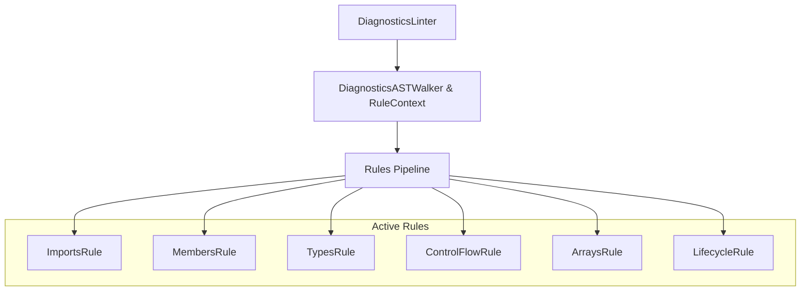

# Plan of Refactoring for `diagnostics.ts` (Linter Rules Delegation)

This document outlines the refactoring plan for [diagnostics.ts](file:///d:/DEV/Projects/data7/vscode-extension-data7/packages/data7-core/src/diagnostics/diagnostics.ts) to decouple its monolithic checking methods and delegate them to the specialized rule modules under the `packages/data7-core/src/diagnostics/rules/` directory.

---

## 1. Analysis of Current Linter Structure & Refactoring Goals

Currently, the `DiagnosticsASTWalker` class inside `diagnostics.ts` contains duplicate, monolithic check methods (e.g. `checkMemberAccess`, `checkAssignment`, `checkVariableDeclaration`, `checkTryCatchStatement`, etc.). Although specialized rule files (e.g., `members-rule.ts`, `types-rule.ts`, `control-flow-rule.ts`) exist in the `rules/` directory, they are completely dormant because `DiagnosticsASTWalker` does not load, instantiate, or invoke them.

### Refactoring Goals:

1. **Modular Checks (SOLID)**: Decompose the monolithic checker methods from `diagnostics.ts` and delegate all node validations to the corresponding rule files in the `rules/` directory.
2. **Walker as Rule Runner**: Refactor `DiagnosticsASTWalker` to act as the walker orchestrator and `RuleContext` provider, dispatching nodes to active rules dynamically.
3. **Incorporate Latest Parser/Linter Fixes**: Ensure that the rule files correctly incorporate recent parser updates (such as support for direct event assignments without `AddressOf` wrappers, operator precedence, etc.).
4. **DRY (Don't Repeat Yourself)**: Eliminate all duplicate checker implementations, reducing `diagnostics.ts` to only the thin orchestrator class `DiagnosticsLinter` and the runner/walker classes.

---

## 2. Proposed Architectural Design

The new design leverages a pluggable rule pipeline. The walker traverses the AST once, dispatching nodes to a list of registered rules:



### A. DiagnosticsASTWalker as RuleContext

`DiagnosticsASTWalker` will implement `RuleContext` from [base-rule.ts](file:///d:/DEV/Projects/data7/vscode-extension-data7/packages/data7-core/src/diagnostics/rules/base-rule.ts). It will expose:

- State information (`activeClass`, `activeMethod`, `allowedTernaries`, etc.).
- Query helper methods (`isLocalDeclared(name)`, `isGenericTypeParameter(name)`).
- Reporting adapter `report(diagnostic)`.

### B. Dynamic Rules Execution

The walker will instantiate all active rules in its constructor:

```typescript
private readonly rules: readonly Rule[] = [
  new ImportsRule(),
  new MembersRule(),
  new TypesRule(),
  new ControlFlowRule(),
  new ArraysRule(),
  new LifecycleRule(),
];
```

During AST traversal, in `walk(node)`:

- Dispatch the node to all rules: `rule.checkNode?(node, this, parent)`.
- Invoke `rule.onStart?(unit, this)` at the start of traversal.
- Invoke `rule.onEnd?(unit, this)` at the end of traversal.

---

## 3. Proposed Changes

### Core Package

#### [MODIFY] [diagnostics.ts](file:///d:/DEV/Projects/data7/vscode-extension-data7/packages/data7-core/src/diagnostics/diagnostics.ts)

- Implement `RuleContext` interface on `DiagnosticsASTWalker`.
- Register and instantiate `ImportsRule`, `MembersRule`, `TypesRule`, `ControlFlowRule`, `ArraysRule`, and `LifecycleRule`.
- Dispatch lifecycle hooks (`onStart`, `onEnd`) and check hooks (`checkNode`) during the walking process.
- Remove duplicate check methods:
  - `checkObjectCreationExpression`
  - `checkMemberAccess`
  - `checkArrayAccess`
  - `checkNativeArrayIndexTypes`
  - `checkIndexedPropertyArgumentTypes`
  - `checkForEachStatement`
  - `checkTaggedTemplateExpression`
  - `checkTernaryExpression`
  - `checkAssignment`
  - `checkVariableDeclaration`
  - `checkMethodDeclaration`
  - `checkDelegateDeclaration`
  - `checkExpressionStatement`
  - `checkTryCatchStatement`
  - `checkIfStatement`
  - `checkReturnStatement`
- Keep shared validation utility helpers (like `validateTypeReference`, `isTypeCompatible`) as static exports so other modules can continue importing them without changes.

#### [MODIFY] [members-rule.ts](file:///d:/DEV/Projects/data7/vscode-extension-data7/packages/data7-core/src/diagnostics/rules/members-rule.ts)

- Sync `checkMethodInvocation` and `checkMemberAccess` changes to ensure direct event delegate handler assignments are supported (avoiding `call-parentheses-mismatch` on direct handler references).

#### [MODIFY] [types-rule.ts](file:///d:/DEV/Projects/data7/vscode-extension-data7/packages/data7-core/src/diagnostics/rules/types-rule.ts)

- Integrate the event signature arity mismatch check directly inside assignment types checking.

---

## 4. Verification Plan

### Automated Tests

- Run `npm run compile -w @data7/core` to verify TypeScript builds cleanly.
- Run `npm run test -w @data7/core` to run all 721 diagnostics and parser unit tests.

### Manual Verification

- Verify that standard warnings (e.g., `call-parentheses-mismatch`, `unknown-member`, `type-mismatch`, `event-signature-mismatch`) are correctly generated in active editor documents.
